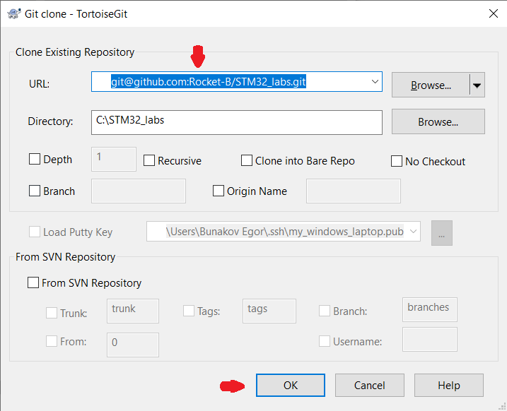

# Установка Git
**1.** Установить:
 - [Git](https://git-scm.com) 
 - [Putty](https://putty.org.ru) 
 - [TortoiseGit](https://tortoisegit.org) 
 
**2.** Отрыть Проводник ⇒ в строке адреса написать **cmd** ⇒ нажать **Enter** (откроется командная строка): 
    В командной строке написать команду ***ssh-keygen (Enter, Enter, Enter, ... Всё по дефолту)***

**3.** Открыть PuTTygen:
- load key (приватный ключ, который без расширения, созданныйssh-keygen) 

- save private key, without passphrase (имя_ключа.ppk) 

**4.** Создать аккаунт на сайте [GitHub](https://github.com/):
- придумать понятный никнейм
- загрузить аватарку
- сообщить свой никнейм преподавателю для получения доступа к курсу 

 
**5.** Зайти в свой аккаунт GitHub ⇒
Аватар (правй верхний угол) ⇒ **Settings** ⇒ **SSH and GPG keys** (в левом столбце) ⇒ **New SSH key** ⇒ вставить в поле key содержимое публичного ключа (имя_ключа.pub) 
(за исключением последних символов до знака **=**) ⇒ нажать **add key** 

**6.** Запустить Pageant:
Если вы получаете такую ошибку:

Тогда ваш Pageant уже запущен и нужно открыть его таким способом:

После запуска Pageant добавляем .ppk ключ **Add Key** (имя_ключа.ppk) 

 
**7.** Зайти на репозиторий с лабораторными работами [STM32_labs](https://github.com/Rocket-B/STM32_labs)

**Code** ⇒ **Local** ⇒ скопировать URL 

**8.** Зайти в проводник (где вы хотите разместить папку с лабораторными работами)
⇒ щелкнуть правой кнопкой мыши ⇒ **Git Clone...**

⇒ в URL вставить скопированный с сайта URL ⇒ **Enter** 

### Если все прошло успешно то поздравляю, вы склонировали репозиторий с лабораторными работами к себе на компьютер !

# Как работать с Git:
- Для большего понимания работы Git советуем посмотреть несколько [видео](https://youtu.be/dK6wgAixwhE?si=vhiid7AkZty6qdii) про git из плейлиста
- Или целый [плейлист]((https://www.youtube.com/playlist?list=PLDyvV36pndZFHXjXuwA_NywNrVQO0aQqb)) про гит 

### Контрольные вопросы по git:
- Что такое репозиторий?
- Чем отличается локальный и удаленный репозиторий?
- Что означают команды:
    - git add
    - git commit
    - git push
- Что такое ветки и как с ними работать?
    - git merge
    - switch/checkout to ...
