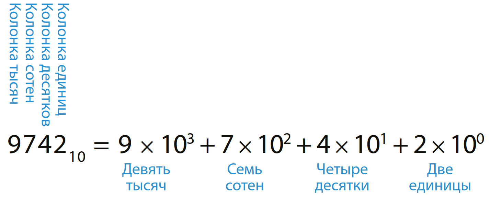
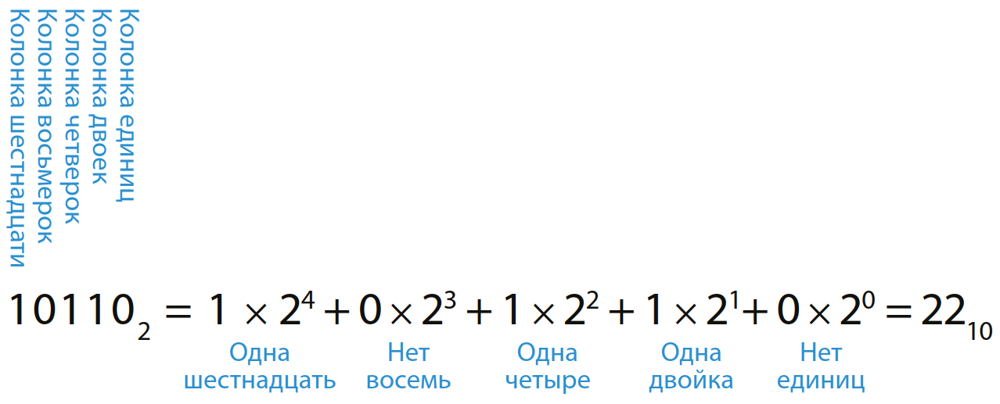
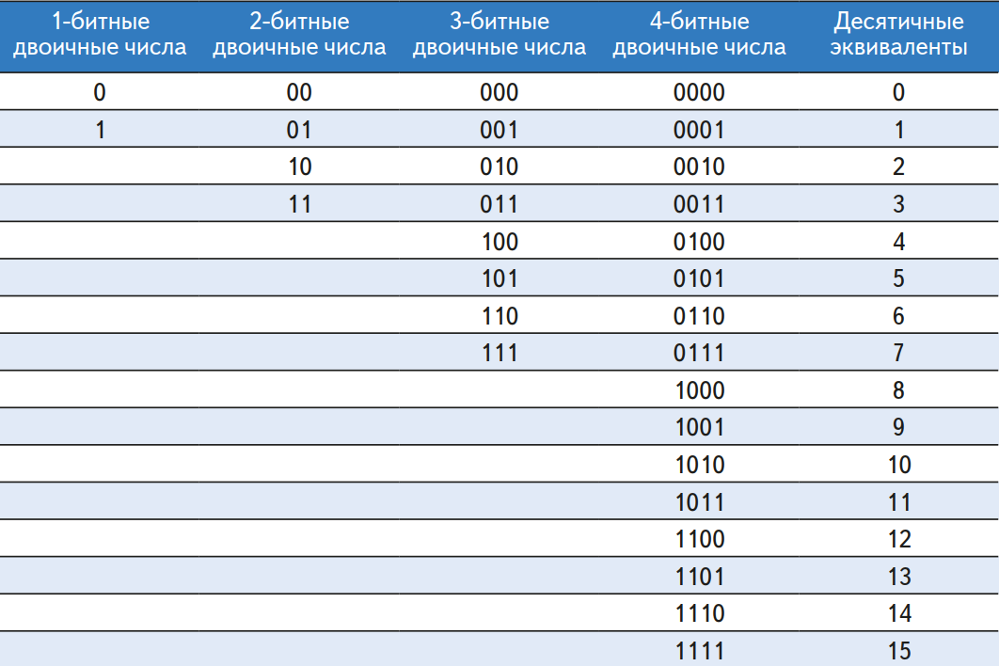

#  Основы языка С #

# Теория #

## Системы исчисления ##

Мы все привыкли работать с десятичными числами. Однако, в цифровых системах, построенных на единицах и нулях, использование двоичных или шестнадцатеричных 
чисел зачастую более удобно.

### Десятичная система счисления ###
Еще в начальной школе нас всех научили считать и выполнять различные арифметические операции в десятичной (decimal) системе счисления. Такая система использует десять арабских цифр: 0, 1, 2, 3, 4, 5, 6, 7, 8, 9 – столько же, сколько у нас пальцев на руках. Числа больше 9 записываются в виде строки цифр. Причем, цифра, находящаяся в каждой последующей позиции такой строки, начиная с крайней правой цифры, имеет «вес», в десять раз превышающий «вес» цифры, находящейся в предыдущей позиции. Именно поэтому десятичную систему счисления называют системой по основанию (base) 10.Справа налево «вес» каждой позиции увеличивается следующим образом: 1, 10, 100, 1000 и т. д.Позицию, которую цифра занимает в строке десятичного числа, называют разрядом или декадой.

Чтобы избежать недоразумений при одновременной работе с более чем одной системой счисления, основание системы обычно указывается путем добавления цифры позади и чуть ниже основного числа: 974210. Рисунок ниже показывает, для примера, как десятичное число 974210 может быть записано в виде суммы цифр, составляющих это число, умноженных на «вес» разряда, соответствующего каждой конкретной цифре.



N-разрядное десятичное число может представлять одну из 10N цифровых комбинаций: 0, 1, 2, 3, … 10N – 1. Это называется диапазоном N-разрядного числа. Десятичное число, состоящее из трех цифр (разрядов), например, представляет одну из 1000 возможных цифровых комбинаций в диапазоне от 0 до 999.

### Двоичная система счисления ###

Одиночный бит может принимать одно из двух значений, 0 или 1. Несколько битов, соединенных в одной строке, образуют двоичное (binary) число. Каждая последующая позиция в двоичной строке имеет вдвое больший «вес», чем предыдущая позиция, так что двоичная система счисления – это система по основанию 2. В двоичном числе «вес» каждой позиции увеличивается (так же, как и в десятичном – справа налево) следующим образом: 1, 2, 4, 8, 16, 32, 64, 128, 256, 512, 1024, 2048, 4096, 8192, 16384, 32768, 65536 и т.д. Работая с двоичными числами, очень полезно для сохранения времени запомнить значения степеней двойки до 216.

Произвольное N-разрядное двоичное число может представлять одну из 2N цифровых комбинаций: 0, 1, 2, 3, … 2N – 1. В Табл. 1.1 собраны 1-битные, 2-битные, 3-битные и 4-битные двоичные числа и их десятичные эквиваленты.

------------------
**ПРИМЕР 1.1**  ПРЕОБРАЗОВАНИЕ ЧИСЕЛ ИЗ ДВОИЧНОЙ СИСТЕМЫ 
СЧИСЛЕНИЯ В ДЕСЯТИЧНУЮ

Преобразовать двоичное число 101102 в десятичное.



------------------

Таблица двоичных чисел и их десятичный эквивалент



------------------
**ПРИМЕР 1.2** ПРЕОБРАЗОВАНИЕ ЧИСЕЛ ИЗ ДЕСЯТИЧНОЙ СИСТЕМЫ 
СЧИСЛЕНИЯ В ДВОИЧНУЮ

Преобразовать десятичное число 8410 в двоичное.

Решение:

Определите, что должно стоять в каждой позиции двоичного результата: 1 или 0. Вы можете делать это, начиная с левой или правой позиции. Если начать слева, найдите наибольшую степень 2, меньше или равную заданному числу (в примере такая степень – это 64). 84 > 64, поэтому ставим 1 в позиции, соответствующей 64. Остается 84 – 64 = 20, 20 < 32, так что в позиции 32 надо поставить 0, 20 > 16, поэтому в позиции 16 ставим 1. Остается 20 – 16 = 4. 4 < 8, поэтому 0 в позиции 8. 4 ≥ 4 – ставим 1 в позицию 4. 4 – 4 = 0, поэтому будут 0 в позициях 2 и 1. Собрав все вместе, получаем 8410 = 10101002. Если начать справа, будем последовательно делить исходное число на 2. Остаток идет в очередную позицию. 84/2 = 42, поэтому 0 в самой правой позиции. 42/2 = 21, 0 во вторую позицию. 21/2 = 10, остаток 1 идет в позицию, соответствующую 4. 10/2 = 5, поэтому 0 в позицию, соответствующую 8. 5/2 = 2, остаток 1 в позицию 16. 2/2 = 1, 0 в 32 позицию. Наконец, 1/2 = 0 с остатком 1, который идет в позицию 64. Снова, 8410 = 10101002

------------------

## Типы данных ## 

В языке программирования C есть несколько основных типов данных. Вот некоторые из них:

**Целочисленные типы данных**:
   - **int**: Целые числа. Обычно 4 байта.
     Пример: int x = 10;
   - **short**: Короткие целые числа. Обычно 2 байта.
     Пример: short y = 5;
   - **long**: Длинные целые числа. Размер зависит от компилятора.
     Пример: long z = 100000L;
   - **char**: Одиночный символ или маленькое целое число.
     Пример: char ch = 'A';

**Вещественные типы данных**:
   - **float**: Числа с плавающей запятой одинарной точности.
     Пример: float a = 3.14f;
   - **double**: Числа с плавающей запятой двойной точности.
     Пример: double b = 2.71828;

**Символьные типы данных**:
   - **char**: Одиночный символ или маленькое целое число.
     Пример: char ch = 'X';

**Логический тип данных**:
   - **_Bool**: Логический тип, может принимать значения 0 (ложь) или 1 (истина).
     Пример: _Bool flag = 1;

**Перечислимый тип данных**:
   - **enum**: Позволяет создавать новый тип данных с конечным набором значений.
     Пример:
     
     enum Weekday {Monday, Tuesday, Wednesday, Thursday, Friday, Saturday, Sunday};
     enum Weekday today = Wednesday;
     

**Составные типы данных**:
   - **struct**: Позволяет объединять различные типы данных в одну структуру.
     Пример:
     
     struct Person {
         char name[50];
         int age;
     };
     struct Person p1 = {"Alice", 25};
     

**Указатели**:
   - **Указатель на тип данных**: Хранит адрес памяти переменной другого типа.
     Пример: int *ptr = &x;

## Операторы ##

### Оператор присваивания (=) ###

Оператор присваивания используется для присвоения значения переменной. Например:

```
int x = 5;
```

### Арифметические операторы: ##

   - Сложение (+):  ```int sum = a + b;```
   - Вычитание (-): ```int difference = a - b;```
   - Умножение (*): ```int product = a * b;```
   - Деление (/): ```int quotient = a / b;```
   - Остаток от деления (%): ```int remainder = a % b;```

### Операторы отношения ###

- Больше чем (>): ```if (a > b) { /* делать что-то */ }```
- Меньше чем (<): ```if (a < b) { /* делать что-то */ }```
- Больше или равно (>=): ```if (a >= b) { /* делать что-то */ }```
- Меньше или равно (<=): ```if (a <= b) { /* делать что-то */ }```
- Равно (==): ```if (a == b) { /* делать что-то */ }```
- Не равно (!=): ```if (a != b) { /* делать что-то */ }```

### Логические операторы ###

- Логическое И (&&): ```if (a > 0 && b < 10) { /* делать что-то */ }```
- Логическое ИЛИ (||): ```if (a == 0 || b == 0) { /* делать что-то */ }```
- Логическое НЕ (!): ```if (!(a == 0)) { /* делать что-то */ }```

### Операторы инкремента и декремента ###

- Инкремент (++): ```a++;```
- Декремент (--): ```b--;```

### Операторы условия (тернарный оператор) ###

```
//если a > b, то присвоить max значение a, иначе присвоить max значение b

int max = (a > b) ? a : b;
```

### Операторы цикла ###

### for: ###
```
for (int i = 0; i < 10; i++) {
         // выполнить действие
     }
```

Перед каждой итерацией цикла проверяется условие ```i > 10```, если условие верно, то выполняется тело цикла и переменная i увеличивает свое значение на единицу ```i++```. Тело цикла выполняется снова и снова, пока условие не становится ложным, в этот момент программа выходит из цикла.

Также for можно использовать для создания замкнутых циклов:

```
for (;;);   // крутимся в цикле вечно
```     

### while: ###

```
while (condition) {
         // выполнить действие
     }
```

Пока ```condition == true``` тело цикла выполняется 


### Операторы ветвления ###

### if-else ###

```
// при выполнения одного действия {} необязательны
if (a > b) c = 10;  // если a больше b, то c = 10
else c = 20;        // если нет, то с = 20

// вместо сравнения можно использовать лог. переменную

bool myFlag, myFlag2;
if (myFlag) c = 10;

// сложные условия
if (myflag && myFlag2) c = 10;    // если оба флага true

// при выполнении двух и более {} обязательны
if (myFlag) {
  с = 10;
  b = c;
} else {
  с = 20;
  b = a;
}
```

### switch ###

```
switch (val) {
  case 1:
    // выполнить, если val == 1
    break;
  case 2:
    // выполнить, если val == 2
    break;
  default:
    // выполнить, если val ни 1 ни 2
    // default опционален
    break;
}
```
Оператор break очень важен, позволяет выйти из switch.

### Операторы ввода/вывода ###
- printf(): 
    ```
    printf("Значение переменной x: %d", x);
    ```

- scanf():
    
    ```
    int input;
    scanf("%d", &input);
    ```
     
## Функции ##

Функции в языке программирования C представляют собой блоки кода, которые могут выполнять определенную задачу. Они позволяют разделить программу на более мелкие и управляемые части, что делает код более организованным и легким для понимания.

Вот пример простой функции в языке C:

```
#include <stdio.h>

// Объявление функции
void greet() {
    printf("Hello, World!\n");
}

int main() {
    // Вызов функции
    greet();
    
    return 0;
}
```

На этом примере:
- greet() - это функция, которая выводит "Hello, World!" в стандартный вывод.
- void - это тип возвращаемого значения функции. void означает, что функция не возвращает никакого значения.
- Функция main() является точкой входа в программу.

## Cтандартная библиотека функций ##

В языке программирования C существует стандартная библиотека функций, называемая стандартной библиотекой языка C (C Standard Library). Она включает различные заголовочные файлы, содержащие объявления функций, макросы и типы данных, которые можно использовать в своих программах. Некоторые из основных библиотек в языке C включают:

1. **stdio.h**:
   - **Функция printf():** Эта функция используется для вывода форматированной информации на стандартный вывод (консоль).
   - **Функция scanf():** Используется для считывания ввода с клавиатуры в соответствии с заданным форматом.

2. **stdlib.h**:
   - **Функция malloc():** Выделяет блок памяти заданного размера и возвращает указатель на начало этого блока.
   - **Функция free():** Освобождает память, ранее выделенную с помощью malloc().

3. **string.h**:
   - **Функция strlen():** Возвращает длину строки (количество символов) без учета завершающего нулевого символа.
   - **Функция strcpy():** Копирует содержимое одной строки в другую.
   - **Функция strcmp():** Сравнивает две строки и возвращает результат сравнения.

4. **math.h**:
   - **Функция sqrt():** Возвращает квадратный корень числа.
   - **Функция sin(), cos(), tan():** Вычисляют синус, косинус и тангенс угла соответственно.

5. **time.h**:
   - **Функция time():** Возвращает текущее время в секундах с начала эпохи (1 января 1970 года).
   - **Функция ctime():** Преобразует время, представленное в виде числа секунд, в строку времени.

Библиотеки C предоставляют различные функции для работы с файлами, строками, памятью, математическими операциями и другими задачами. Они упрощают написание программ и делают код более эффективным и переносимым. Каждая библиотека имеет свои функции, которые решают определенные задачи.

## Массивы и матрицы ##

В языке программирования C массивы и матрицы описываются с использованием обычных переменных и указателей. Вот подробное объяснение с примерами кода:

### Описание массивов в C:
- **Определение массива:** Массив в C - это набор элементов одного типа, расположенных в памяти последовательно.
- **Синтаксис объявления массива:** тип_данных имя_массива[размер];

Пример объявления и инициализации массива:

```
#include <stdio.h>

int main() {
    int numbers[5] = {1, 2, 3, 4, 5}; // Объявление и инициализация массива чисел
    for (int i = 0; i < 5; i++) {
        printf("%d ", numbers[i]); // Вывод элементов массива
    }
    return 0;
}
```

### Описание матриц в C:
- **Матрица в C - это двумерный массив, представляющий собой таблицу элементов.
- **Синтаксис объявления матрицы:** тип_данных имя_матрицы[строки][столбцы];

Пример объявления и инициализации матрицы:

```
#include <stdio.h>

int main() {
    int matrix[3][3] = {
        {1, 2, 3},
        {4, 5, 6},
        {7, 8, 9}
    }; // Объявление и инициализация матрицы 3x3
    for (int i = 0; i < 3; i++) {
        for (int j = 0; j < 3; j++) {
            printf("%d ", matrix[i][j]); // Вывод элементов матрицы
        }
        printf("\n"); // Переход на новую строку после каждой строки матрицы
    }
    return 0;
}
```

### Доступ к элементам массивов и матриц:
- Для доступа к элементам массивов и матриц используются индексы (начиная с 0).
- Для массивов: имя_массива[индекс]
- Для матриц: имя_матрицы[строка][столбец]


# Самостоятельная работа #

Для самостоятельной работы вам предлагается закрепить основы языка Си на практике, сделать вы это можете в [VS Code](https://code.visualstudio.com). Установите VS Code и настройте его на работу с Си, как это сделать подробно описано в  [официальной документации по настройке vs code](https://code.visualstudio.com/docs/cpp/config-mingw).

- Попробуйте запустить примеры кода, приведенные как примеры в теоретической части.
- Напишите программу, которая будет производить все арифметические операции с двумя заданными вами числами и выводить результат.
- Напишите программу, которая будет производить все логические операции с двумя заданными вами цифрами и выводить результат.
- Напишите программу, в которой будут использоваться операторы: **if**, **else**, **switch**.  
- Задача со звездочкой*:
    Реализуйте сортировку массива методом "***пузырек***"
