# Первая прошивка

## Необходимые компоненты ##
Для прохождение данной лабораторной работы вам понадобится:
- отладочная плата с stm32 (BluePill)
- программатор ST-Link V2
- программа CubeIde
- программа ST-Link Utility

> [!NOTE] 
> Ссылки на для скачивания программ есть в [конце README.md](https://github.com/Rocket-B/STM32_labs/tree/main)

## Подключение ##

Первым делом нужно подключить BluePill к программатору ST-Link V2

Ниже представлена схема подключения:

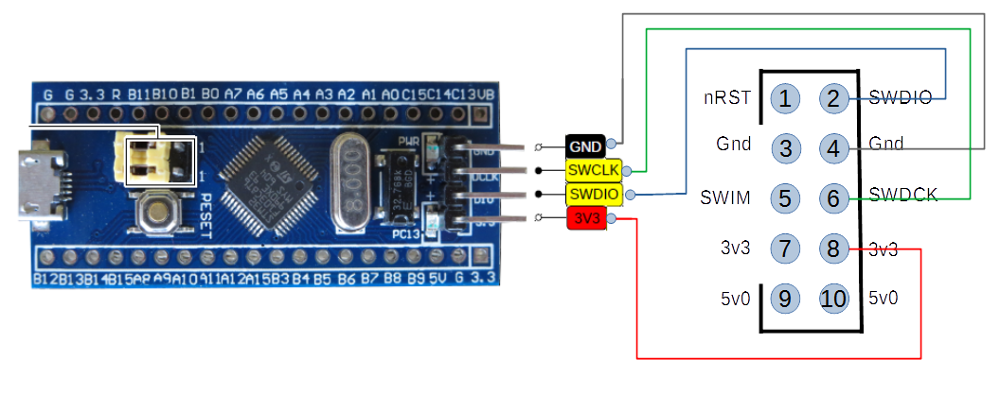

## ST-Link Utility ##

Далее подключаем ST-Link V2 к компьютеру через USB порт, и открываем ST-Link Utility. Данная программа потребуется нам для проверки, работает ли сам чип stm, с помощью нее мы можем подключиться к микроконтроллеру, считать его прошивку, или загрузить на него уже готовую прошивку в виде .bin файла.

После того как программа открылась, нажимаем **Connect to the target** 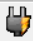

Если вы все подключили верно и плата работает, то память будет считана и частично отображаться на экране.

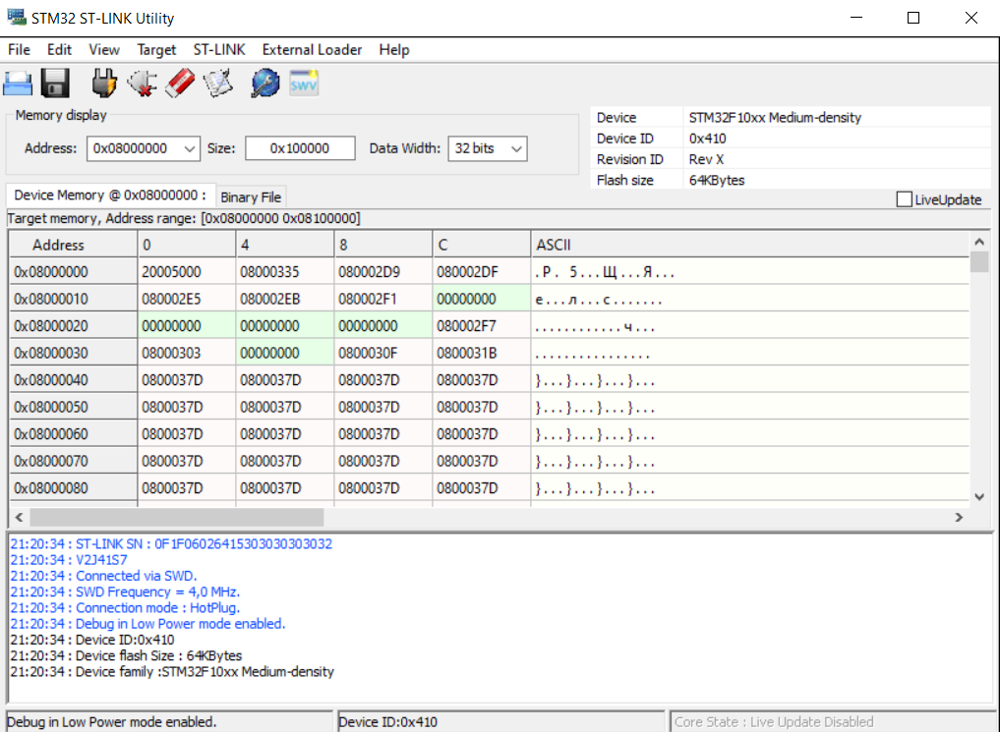

После того как мы убедились, что все работает, отключаемся от stm_ки, нажав кнопку **Disconnect from the target**  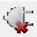 и закрываем программу.

> ![NOTE]
> Возможно, что на вашей новой stm не будет никакой прошивки, когда вы достанете ее из коробки. Тогда при подключении считываемая память будет заполнена FFFFFFFF. Если в дальнейшем вы захотите отчистить свой контроллер от прошивки ⇒ нажимаете **Full chip erase**  и память будет отчищена (заполнена FFFFFFFF).
 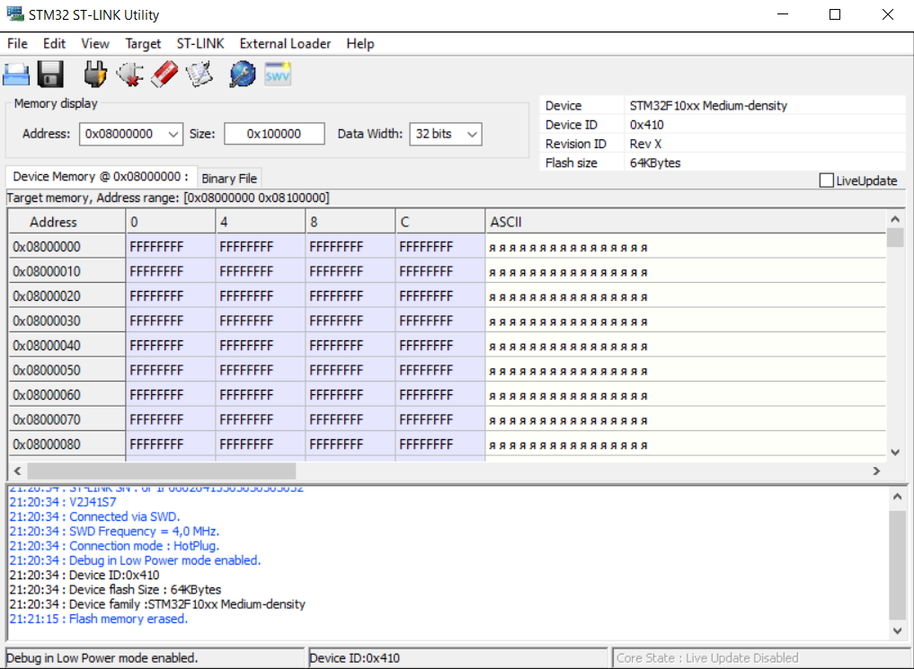

## Первая прошивка платы ##

После того, как мы убедились, что все верно подключили, давайте напишем свою первую прошивку, которая будет мигать светодиодом на плате BluePill, для этого:

Открываем CubeIde и в верхней панели выбираем: 

⇒ File ⇒ New ⇒ STM32 Project

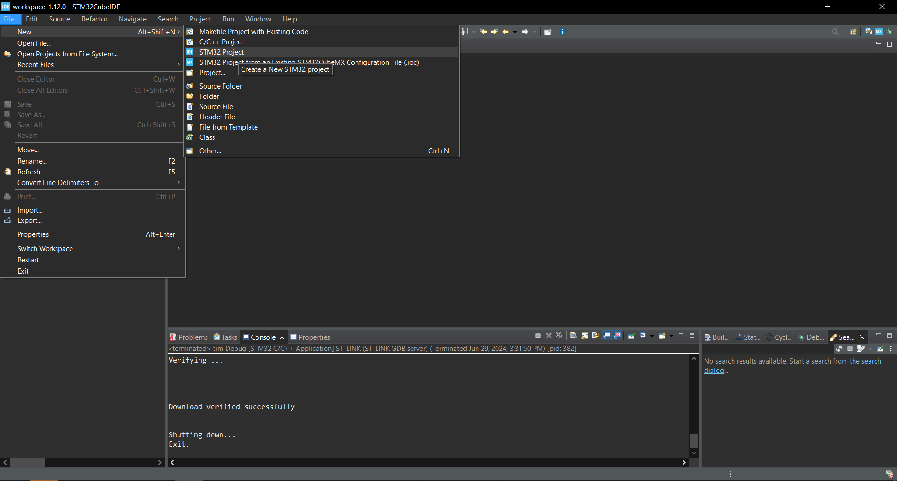

Далее вводим название модели чипа stm ⇒ выбираем его в правой нижней области экрана ⇒ жмем **Next**

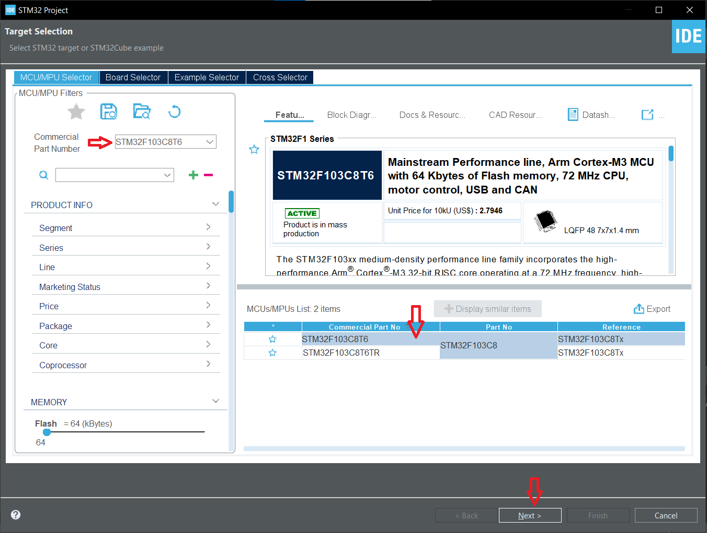

Отлично, теперь наш проект под именно наш контроллер сгенерировался. В левой части экрана открывается поле Project Explorer, где мы можем видеть все файлы проекта. 

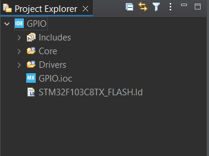

Справа открылся файл с расширением .ioc, слева вкладки для настройки тактирования, портов ввода-вывода и различной периферии.

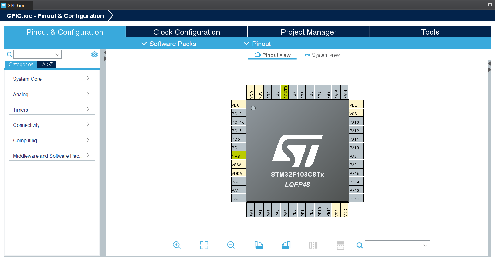

В первую очередь подключим два пина на контроллере для отладки нашей будущей программы:

⇒ **System Core** ⇒ **SYS** ⇒ **Debug** (Serial Wire)

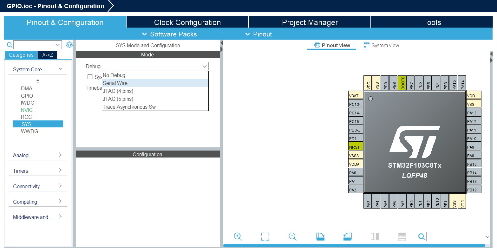

В итоге должно получиться вот так:

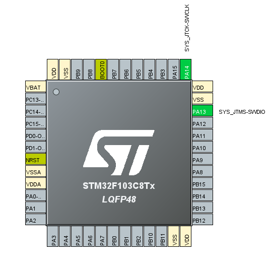

Далее подключим GPIO пин настроенный на выход для светодиода.

Чтобы определить какой пин подключен к светодиоду на плате BluePill, необходимо открыть [схемотехнику платы](https://github.com/Rocket-B/STM32_labs/blob/main/doc/Blue_Pill.pdf). 

На схемотехнике необходимо найти светодиод по его условно графическому обозначению (УГО). 

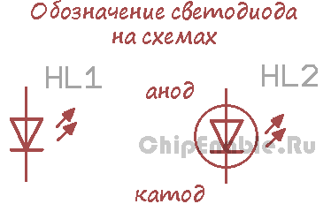

> [!NOTE]
> Светодиод пропускает через себя ток, только в том случае, если напряжение на аноде больше, чем напряжение на катоде. УГО светодиода напоминает стрелку в направлении которой должен течь ток, для того, чтобы светодиод загорелся. Ток течет от большего напряжения к наименьшему.

> По определению напряжение == разность потенциалов. За нулевой потенциал мы берем землю (на схемах обозначается как ```GND```), от земли и будем отсчитывать все напряжения.

Как мы видим на плате есть два светодиода, верхний подключен с одной стороны к общему питанию платы, которое составляет 3,3 В (VCC3V3), а с другой через резистор к земле платы (GND). То есть в момент, когда на плате будет питание == 3V3, этот светодиод будет гореть.

> [!NOTE]
> Зачастую на схемах питание обозначается буквами ```Vсс``` или конкретно номиналом ```3V3```, ```5V0```, земля же может обозначаться как ```Vss``` или ```GND``` 


Рассмотрим теперь нижний светодиод, которым мы хотим поморгать, ток через него будет течь только в том случае, если в точке ***1*** будет напряжение меньше чем 3V3, в нашем случае GND, возьмем это на вооружение.

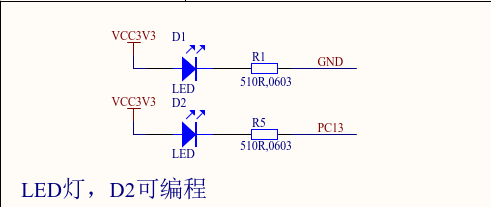

Заметим, что точка ***1*** подключена к ножке PC13 микроконтроллера (в дальнейшем для краткости мк).

Настроим ножку как GPIO_Output, вкратце данный режим позволит нам подтягивать (подключать) ножку либо к питанию, либо к земле, тем самым включать и выключать светодиод.

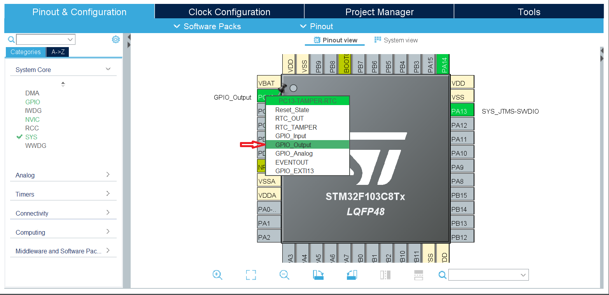

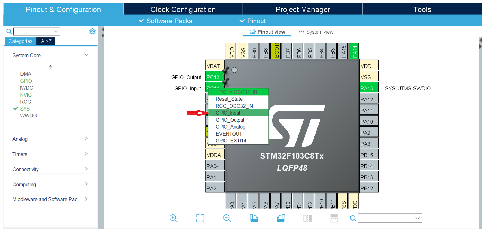

Теперь настроим GPIO:

⇒ **System Core** ⇒ **GPIO**

Выставим:
- **GPIO output level** == High
- **User label** == led

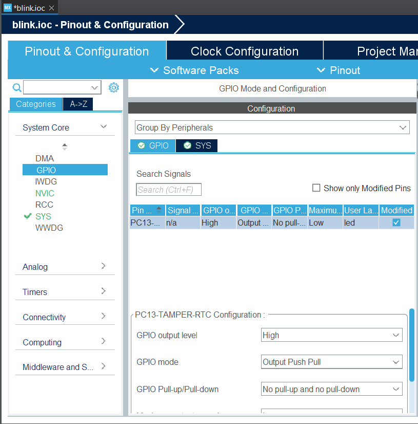

<br>

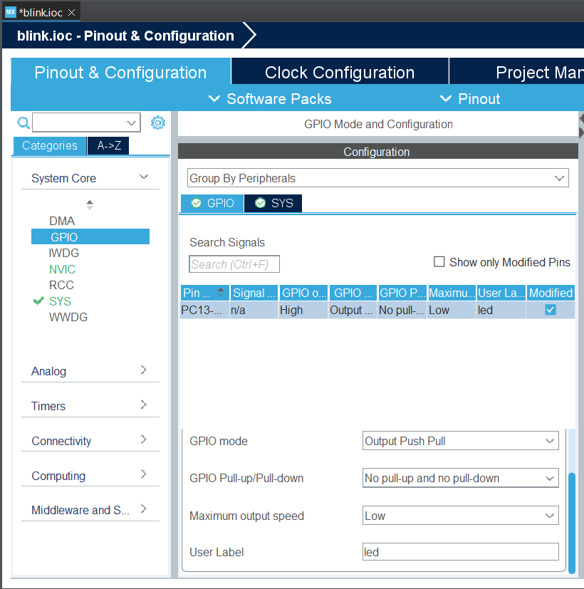

<br>

Теперь, после настройки ножек мк, нажимаем на шестеренку  в верхней панели, тем самым CubeIde сгенерирует код на языке си, где уже будет прописано все, что мы выставили ранее.

В левой части экрана ... НАДО ПИСАТЬ ДАЛЬШЕ

Генератор кода вызвал функции инициализации тактирования и GPIO. 

```
/* Private function prototypes -----------------------------------------------*/
void SystemClock_Config(void);
static void MX_GPIO_Init(void);
```