# GPIO

## Теория ##

[Видео леция](https://www.youtube.com/watch?v=ynBOKPnYlyY&list=PLhtMaaf_npBzsEQ94eGn5RnuE-VdGVObR&index=5)

#### Методический материал ####

В системе STM32 применяется общепринятое название портов ввода-вывода общего назначения, а именно GPIO (General purpose input-output).

Под “общим назначением” имеется в виду, что состояние выводов устанавливается или считывается программно, т.е. вывод не является входным или выходным сигналом какого-либо аппаратного узла микроконтроллера.

В системе STM32:

- Порты обозначаются GPIOA, GPIOB, GPIOC и т.д. На схеме микроконтроллера соответствующие портам выводы обозначаются PA0-PA15, PB0-PB15, PC0-PC15…
- Порты 16ти разрядные, т.е. у каждого порта 16 выводов.
- Режим и состояние каждого вывода могут быть установлены отдельно, независимо от других выводов.
- Каждый вывод может использоваться в режиме:
    - Input floating – вход без подтягивающего резистора, брошенный в воздухе вход.
    - Input pull-up – вход с подтягивающим резистором, подключенным к питанию микроконтроллера.
    - Input pull-down - вход с подтягивающим резистором, подключенным к общему проводу (земле).
    - Analog – аналоговый вход ( вход АЦП, компараторов и т.п.).
    - Output open-drain – выход с открытым стоком. Функционально аналогичен выходу с открытым коллектором. При низком логическом уровне замыкает вывод на землю, при высоком – бросает в воздухе.
    - Output push-pull – обычный активный выход. При низком логическом уровне напряжение на выводе равно 0, при высоком – напряжение близко к напряжению питания микроконтроллера, обычно + 3 В.
    - Alternate function push-pull – альтернативная функция вывода в обычном (активном) режиме.
    - Alternate function open-drain – альтернативная функция вывода в режиме открытый сток.
- Существует система защиты конфигурационных параметров порта. Для ее активизации необходимо выполнить определенную последовательность действий над регистрами конфигурации. Разблокировка происходит только после сброса.
- В нашем микроконтроллере STM32F103C8T6 существуют 37 портов ввода-вывода:
GPIOA – 16 выводов: PA0-PA15;
GPIOB – 16 выводов: PB0-PB15;
GPIOC – 3 вывода: PC13-PC15;
GPIOD – 2 выводов: PD0, PD1.


### Порты STM32 с аппаратной точки зрения ###

К портам ввода-вывода мы будем подключать реальные аппаратные устройства, узлы, схемы. Поэтому важно знать, как они устроены, их электрические характеристики.

В документации приводится базовая схема вывода порта.

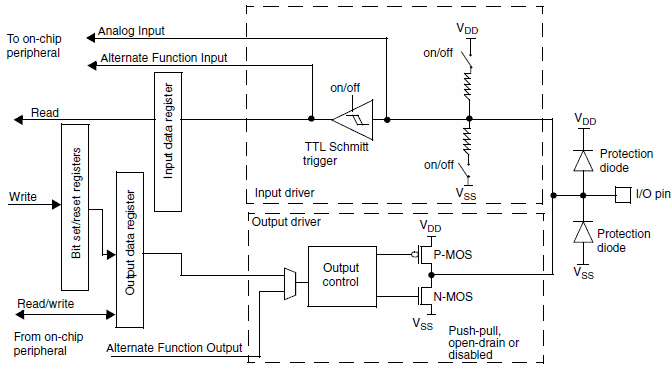

Нас интересует  правая, выходная часть.

#### Режим входа ####

При использовании вывода в качестве входа,  к нему могут быть подключены подтягивающие резисторы сопротивлением порядка 40 кОм. Либо к питанию Vdd, либо к земле Vss.

Согласно схеме к выводу подключены 2 защитных диода. Один на землю Vss, другой на шину питания Vdd. Первый замыкает через себя входное напряжение отрицательной полярности, другой ограничивает его на уровне Vdd, у нас на плате это 3,3 В.

Далее сигнал со входа попадает на вход [триггера Шмитта](https://ru.wikipedia.org/wiki/%D0%A2%D1%80%D0%B8%D0%B3%D0%B3%D0%B5%D1%80_%D0%A8%D0%BC%D0%B8%D1%82%D1%82%D0%B0) на выходе которого уже оцифрованный сигнал либо 0 либо 1.

#### Режим выхода ####

В режиме выхода порта работают 2 комплементарных  транзистора.

- В активном режиме они открываются по очереди, соединяя выход с шиной питания или землей.
- В режиме с открытым стоком работает только нижний транзистор, замыкая выход на землю при низком логическом уровне.

## Практика ##

В нашем проекте будем по нажатию кнопки зажигать светодиод, при последующим нажатии светодиод будем гасить.

Обратимся к схеме отладочной платы BluePill, как мы видим, светодиод **D2** подключен к ножке stm **PC13**. Так как на плате BluePill нет кнопки, то будем использовать внешнюю кнопку, подключим одну ножку кнопки к GND а другую к **PC14**.

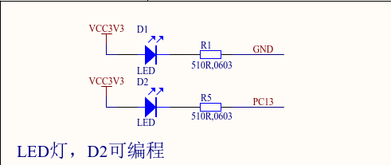

Нам нужно подключить только два вывода кнопки, всего у кнопки их четыре, с помощью схемы соединения контактов, определите к каким выводам нужно подключиться, чтобы при нажатии происходило замыкание.

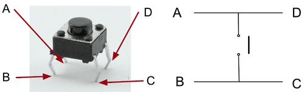

Далее открываем CubeIde и создаем проект:

⇒ File ⇒ New ⇒ STM32 Project

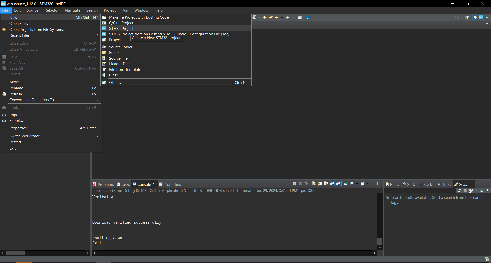

Далее вводим название модели чипа stm ⇒ выбираем его в правой нижней области экрана ⇒ жмем **Next**

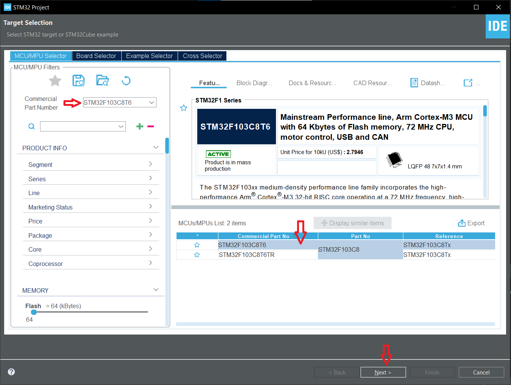

Отлично, теперь наш проект под именно наш контроллер сгенерировался. В левой части экрана открывается поле Project Explorer, где мы можем видеть все файлы проекта. 

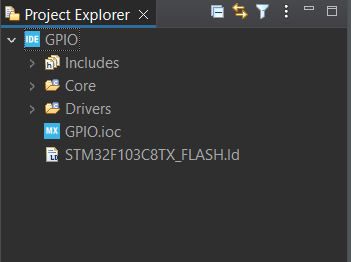

Справа открылся файл с расширением .ioc, слева вкладки для настройки тактирования, портов ввода-вывода и различной периферии.

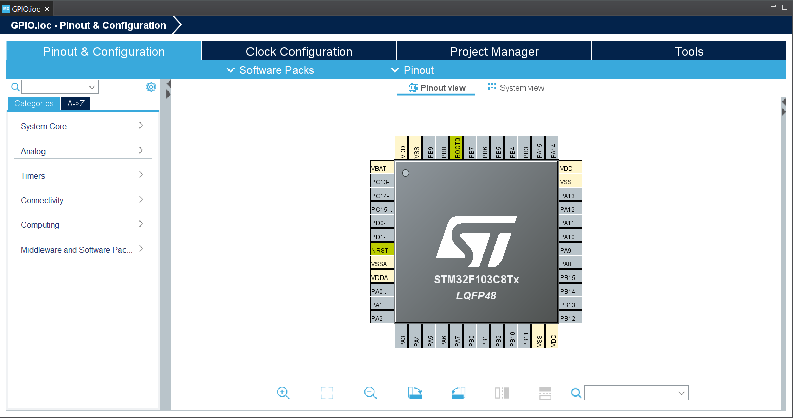

В первую очередь подключим два пина на контроллере для отладки нашей будущей программы:

⇒ **System Core** ⇒ **SYS** ⇒ **Debug** (Serial Wire)

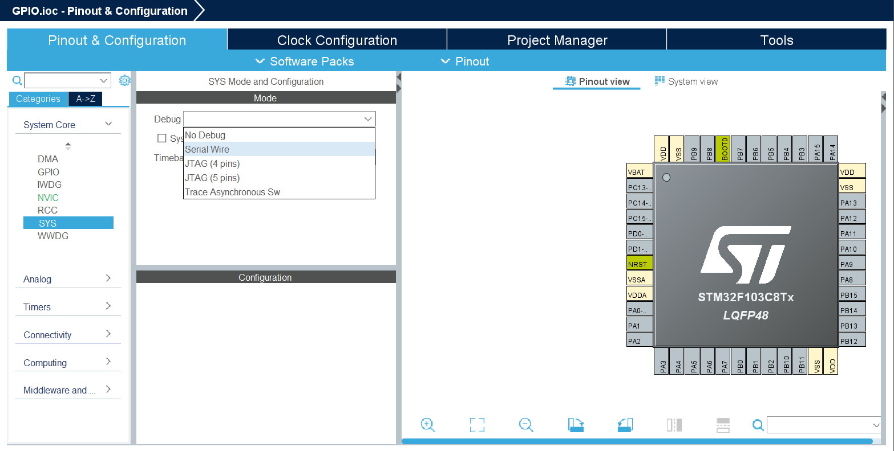

В итоге должно получиться вот так:

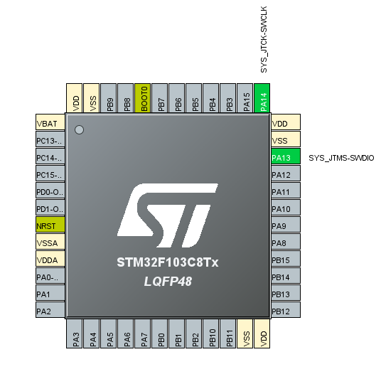

Далее подключим GPIO пины настроенные на выход и вход для светодиода и кнопки соответственно.

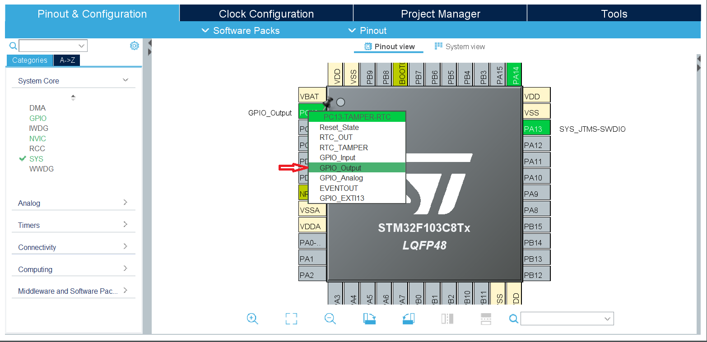

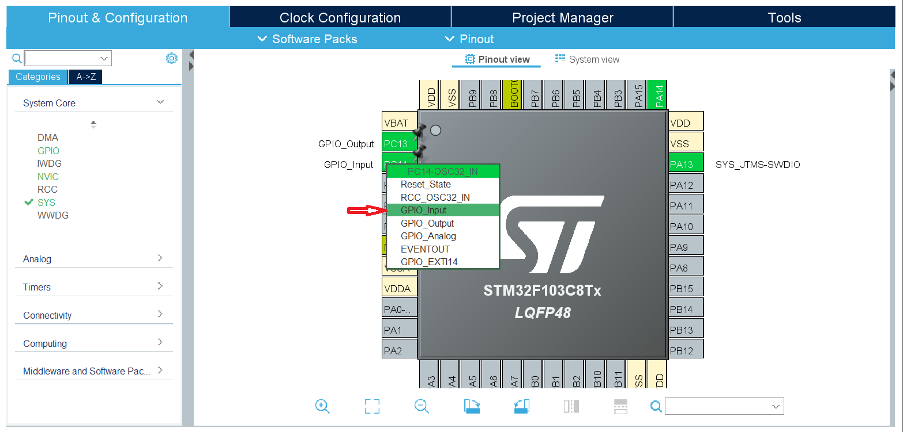

Теперь настроим GPIO:

⇒ **System Core** ⇒ **GPIO**

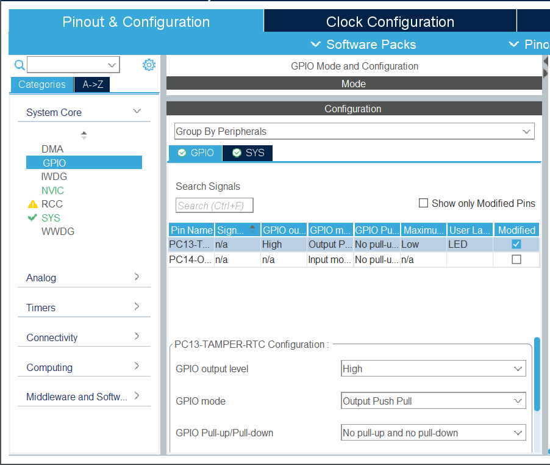

<br>

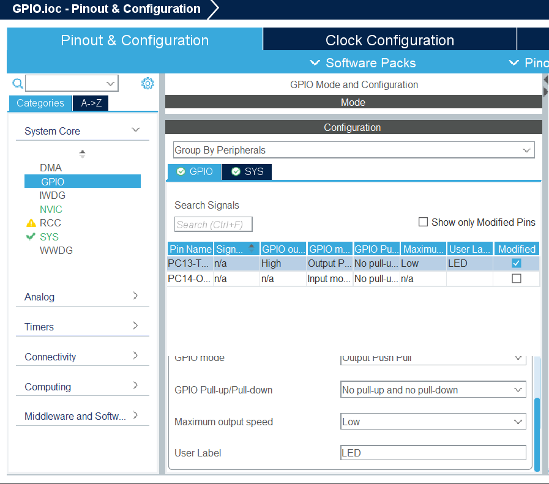

<br>


</details>

<details>
  <summary>GPIO output level</summary>

<br>
Обратите внимание, что светодиод с одной стороны подключен к 3V3, а с другой к ножке PC13, следовательно когда на ножке будет напряжение ниже 3V3, ток потечет от большего напряжения к меньшему и светодиод загорится, поэтому в первом поле настроек мы ставим **High**, чтобы изначально светодиод не горел, а кода из кода мы подтянем ножку к земле, то потечет ток и светодиод загорится.


</details>

<details>
  <summary>GPIO mode</summary>

<br>
1. Push-Pull (толкающий выход):
   - Push-Pull — это наиболее распространенный режим работы порта вывода. В этом режиме микроконтроллер может устанавливать напряжение на выводе как на уровне логической "1" (обычно VCC), так и на уровне логического "0" (обычно GND).
   - В режиме Push-Pull микроконтроллер активно удерживает выходной сигнал на нужном уровне, предоставляя как положительное, так и отрицательное напряжение на выходе.
   - Этот режим обеспечивает более высокую скорость переключения и может быть использован для прямого управления нагрузками с низким сопротивлением.

2. Open-Drain (открытый сток):
   - Open-Drain — это режим, при котором микроконтроллер может устанавливать только низкий уровень логического "0" на выходе, а для установки логического "1" требуется внешнее подтягивающее сопротивление к источнику питания.
   - В режиме Open-Drain микроконтроллер либо подключает вывод к земле (логический "0"), либо оставляет его открытым (логический "1").
   - Этот режим обычно используется для работы с шинами данных, где необходимо обеспечить общий уровень логического "1" на линии при работе нескольких устройств.


</details>

<details>
  <summary>GPIO Pull-up/Pull-down</summary>
  <br>  
  Подтяжка ножки GPIO либо к питанию, либо к земле. 


</details>

<details>
  <summary>Maximum output speed</summary>

  <br>
  Maximum output speed (максимальная скорость вывода) на микроконтроллерах STM32 относится к настройке скорости изменения состояния вывода GPIO (General Purpose Input/Output). Это параметр определяет, как быстро порт вывода может переключаться между высоким и низким уровнями.


</details>

<details>
  <summary>User label</summary>

  ```
  Название ножки микроконтроллера (будет в дальнейшем использоваться в коде)
  ```
  </details>

<br>
С ножкой для управления кнопкой поступаем так:

<br>

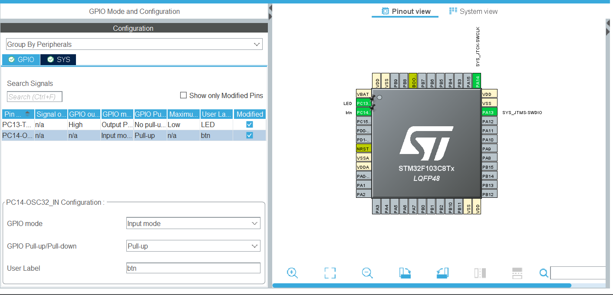

Так как кнопку с одной стороны мы подключили к земле, а с другой стороны к ножке мк, то в момент когда кнопка отжата мы хотим, чтобы ножка была в высоком состоянии, а при нажатии ножка подтягивается к земле и находится в низком состоянии. Тем самым мы будем отлавливать момент перехода с высокого напряжения на ножке на низкое.

После того как все ноги мк настроены, нажимаем на шестеренку  в верхней панели, тем самым CubeIde сгенерирует код на языке си, где уже будет прописано все, что мы выставили ранее.

Генератор кода вызвал функции инициализации тактирования и GPIO. 

```
/* Private function prototypes -----------------------------------------------*/
void SystemClock_Config(void);
static void MX_GPIO_Init(void);
```

Создадим глобальную переменную, которая будет содержать в себе состояние кнопки, назовем ее **btn_сlick**

Для работы с переменными типа bool:

```
/* USER CODE BEGIN Includes */
#include "stdbool.h"
/* USER CODE END Includes */
```

```
/* USER CODE BEGIN PV */
bool btn_click = false;
/* USER CODE END PV */
```

Если кнопка нажата, то **btn_сlick** == true иначе **btn_сlick** == false.

```
bool btn_click = false;      // глобальная переменная, флаг нажатия кнопки
```

```
  /* USER CODE BEGIN WHILE */
  while (1)
  {
	  btn_click = !(HAL_GPIO_ReadPin(btn_GPIO_Port,btn_Pin));

	  if(btn_click == true){
		  HAL_GPIO_WritePin(LED_GPIO_Port, LED_Pin, GPIO_PIN_SET);
	  }
	  else
	  {
		  HAL_GPIO_WritePin(LED_GPIO_Port, LED_Pin, GPIO_PIN_RESET);
	  }
    /* USER CODE END WHILE */
```
Давайте теперь напишем программу, чтобы светодиод горел одну секунду по нажатию на кнопку, а потом выключался:
 
Для этого воспользуемся функцией ```HAL_Delay(ms);```, которая принимает значение в миллисекундах, после вызова функции программа остановится на количество миллисекунд, которое было передано в качестве аргумента.

```
/* USER CODE BEGIN WHILE */
  while (1)
  {
	  btn_click = !(HAL_GPIO_ReadPin(btn_GPIO_Port,btn_Pin));

	  if(btn_click == true){
		  HAL_GPIO_WritePin(LED_GPIO_Port, LED_Pin, GPIO_PIN_SET);
          HAL_Delay(1000);
          HAL_GPIO_WritePin(LED_GPIO_Port, LED_Pin, GPIO_PIN_RESET);
	  }
    /* USER CODE END WHILE */
```
<br>
Попробуйте самостоятельно реализовать различные упражнения с кнопкой и светодиодом, например:

- После нажатие светодиод загорается несколько раз или моргает с определенной частотой.
- Светодиод загорается при нажатии на кнопку и затухает только при последующем нажатии.