# HAL EXTI внешние прерывания

[Видео лекция](https://www.youtube.com/watch?v=bVaeav9mZZ0&list=PLhtMaaf_npBzsEQ94eGn5RnuE-VdGVObR&index=7) 

Внешние прерывания — это такие прерывания, которые обрабатываются вследствие возникновения некоторых событий на определённой ножке порта микроконтроллера. Таких событий может быть несколько не смотря на всего 2 логических состояния. Разнообразие данных событий легко увидеть, раскрыв их список в CubeMX в настройке ножек портов.

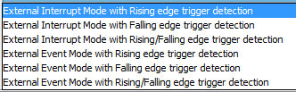

Можно разделить данные типы на 2 группы пополам. первая группа — External Interrupt — это обработка внешних прерываний. А второй — обработка событий.

<details>
  <summary> Прерывание (Interrupt)</summary>

- Прерывание - это механизм, который позволяет микроконтроллеру прервать выполнение текущей инструкции и перейти к выполнению обработчика прерывания.
- Прерывания используются для обработки внешних сигналов (например, сигналов от периферийных устройств, таких как таймеры, UART, GPIO), чтобы реагировать на события в реальном времени.
- Прерывания могут быть маскируемыми (разрешаемыми и запрещаемыми) и немаскируемыми (не могут быть запрещены).
- Каждое прерывание имеет свой приоритет, что позволяет определять порядок их обработки.

</details>

<details>
  <summary>Событие (Event)</summary>

- Событие - это изменение состояния или сигнал, который 
происходит внутри микроконтроллера или программы.
- События не приводят к немедленной остановке выполнения 
текущего кода, как это делает прерывание. Вместо этого 
они могут быть обработаны программой в удобное для нее 
время.
- События могут быть использованы для уведомления 
программы о том, что произошло определенное условие или 
изменение состояния, но они не требуют немедленного 
вмешательства.

</details>

<br>

Рассмотрим более подробно прерывания и их настройки в CubeMX:

⇒ Обнаружен восходящий фронт (изменение уровня 0 на 1),

⇒ Обнаружен нисходящий фронт (изменение уровня 1 на 0),

⇒ Обнаружен любой из вышеперечисленных фронтов.

В лабораторной работе GPIO для самостоятельной работы было выдано задание, включать и выключать светодиод только по нажатию на кнопку. Вы должны были заметить, что опрашивая ножку мк подключенную к кнопке в бесконечном цикле, и в зависимости от ее состояния зажигая или гася светодиод система работала не стабильно. И иногда при нажатии светодиод мог резко загореться и сразу же погаснуть. 

Веной всему этому дребезг контактов, который приводит к нестабильному состоянию кнопки во время нажатия.

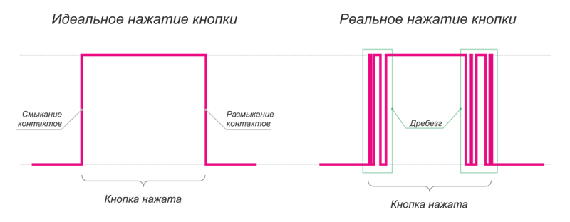

Существует несколько решений проблемы дребезга контактов, сегодня рассмотрим одно из них с использованием системы внешних прерываний.

Для начала повторим часть лабораторной работы GPIO:
- физически подключим кнопку 
- настроим светодиод в CubeMX 

Теперь в отличии от лабораторной работы GPIO, настроим ножку мк подключенную к кнопке как **GPIO_EXTI14**

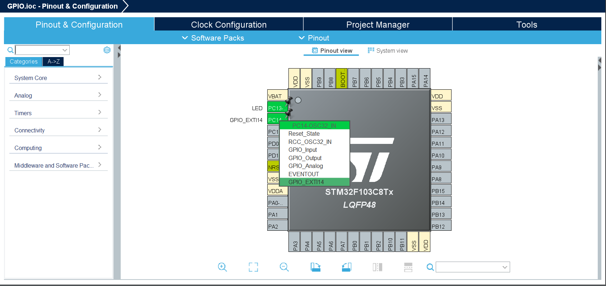

Так как наша кнопка подключена к земле, то сделаем внутреннюю подтяжку ножки **PC14** к питанию, а прерывание будет вызываться при нисходящем фронте сигнала.

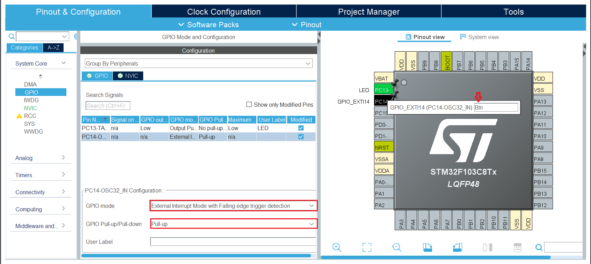

> [!NOTE]
> Второй способ дать ножке название: нажать правой кнопкой мыши на ножку мк (к примеру PC14) ⇒ **Enter User Label** ⇒ ***Btn***

Также включим NVIC:

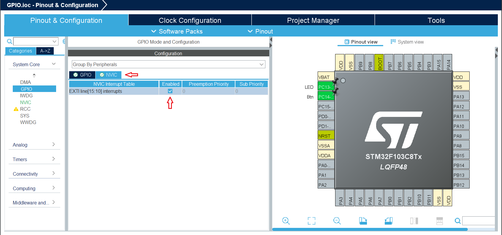

Далее генерируем код 

Создадим две переменные

```
uint8_t flag_irq = 0;
uint32_t time_irq = 0;
```

Переопределим колбек внешнего прерывания

```
/* USER CODE BEGIN 4 */
void HAL_GPIO_EXTI_Callback(uint16_t GPIO_Pin){
	  if(GPIO_Pin == Btn_Pin){
		  HAL_NVIC_DisableIRQ(EXTI15_10_IRQn);  // сразу же отключаем прерывания на этом пине
		  flag_irq = 1;							//поднимаем флажок
		  time_irq = HAL_GetTick();				//запоминаем текущее время
	  }
}
/* USER CODE END 4 */
```

При попаданию в колбек мы сразу отключаем прерывание, чтобы избежать вызова следующего прерывания от дребезга контактов, далее устанавливаем флаг, и сохраняем значение HAL_GetTick().

Всё что связано с таймером нам больше не нужно.

В бесконечном цикле проверяем флаг и ждём когда счётчик превысит 200мс…

```
  /* USER CODE BEGIN WHILE */
  while (1)
  {
	  if(flag_irq && (HAL_GetTick() - time_irq) > 200)
	  {
	    __HAL_GPIO_EXTI_CLEAR_IT(Btn_Pin);  // очищаем бит EXTI_PR
	    NVIC_ClearPendingIRQ(EXTI15_10_IRQn); // очищаем бит NVIC_ICPRx

	    HAL_GPIO_TogglePin(LED_GPIO_Port, LED_Pin);

	    HAL_NVIC_EnableIRQ(EXTI15_10_IRQn);   // включаем внешнее прерывание

	    flag_irq = 0;
	  }

    /* USER CODE END WHILE */

    /* USER CODE BEGIN 3 */
  }
```

Через 200 мс очищаем биты, меняем состояние светодиода и включаем внешнее прерывание (ожидаем следующее нажатие на кнопку).

Собираем код и заливаем на плату, если все прошло успешно, то баги с дребезгом контактов должны быть устранены.

## Используемые функции HAL ##

- HAL_GPIO_TogglePin(LED_GPIO_Port, LED_Pin);
- HAL_NVIC_EnableIRQ(EXTI15_10_IRQn);
- HAL_NVIC_DisableIRQ(EXTI15_10_IRQn);
- __HAL_GPIO_EXTI_CLEAR_IT(Btn_Pin);
- HAL_GetTick();

## Самостоятельная работа ##

Попробуйте самостоятельно реализовать программу подсчета нажатий на кнопку.

## Решение самостоятельной работы ##

```
/* USER CODE BEGIN WHILE */
  while (1)
  {
	  if(flag_irq && (HAL_GetTick() - time_irq) > 200 && HAL_GPIO_ReadPin(Btn_GPIO_Port, Btn_Pin) == GPIO_PIN_RESET)
	  {
	    __HAL_GPIO_EXTI_CLEAR_IT(Btn_Pin);  // очищаем бит EXTI_PR
	    NVIC_ClearPendingIRQ(EXTI15_10_IRQn); // очищаем бит NVIC_ICPRx

	    counter ++;
	    HAL_NVIC_EnableIRQ(EXTI15_10_IRQn);   // включаем внешнее прерывание

	    flag_irq = 0;
	  }

    /* USER CODE END WHILE */

    /* USER CODE BEGIN 3 */
  }
  ```

  ```
  /* USER CODE BEGIN 4 */
void HAL_GPIO_EXTI_Callback(uint16_t GPIO_Pin){
	  if(GPIO_Pin == Btn_Pin){
		  HAL_NVIC_DisableIRQ(EXTI15_10_IRQn);  // сразу же отключаем прерывания на этом пине
		  flag_irq = 1;							//поднимаем флажок
		  time_irq = HAL_GetTick();				//запоминаем текущее время
	  }
}
/* USER CODE END 4 */
```

Из кода выше понятно, что при каждом нажатии переменная **counter** увеличивается на единицу, но как же отследить значение **counter**? Для этого нам нужен [отладчик (debugger)](https://ru.wikipedia.org/wiki/%D0%9E%D1%82%D0%BB%D0%B0%D0%B4%D1%87%D0%B8%D0%BA).

После сборки программы нажимаем кнопку "***войти в отладчик***" 
Далее в правой части экрана находим вкладу **Live Expressions**

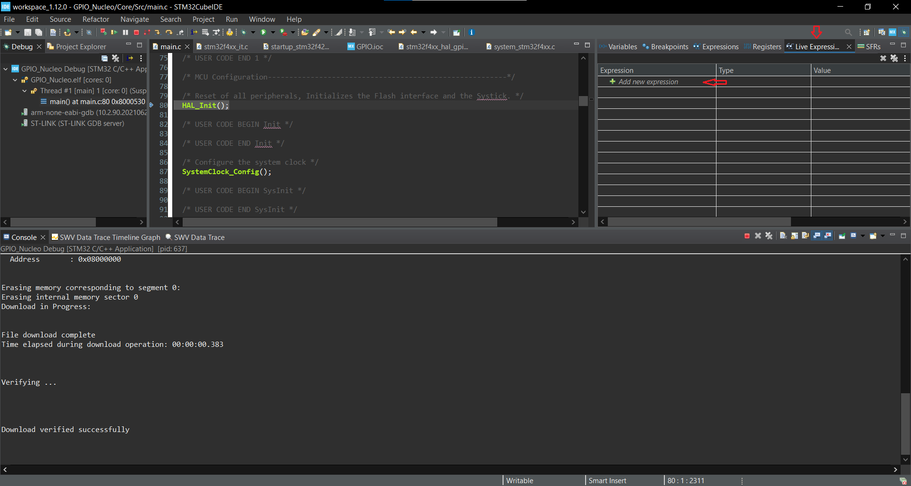

Нажимаем кнопку **Add new expression** и вводим название отслеживаемой переменной. В итоге должно получиться так:

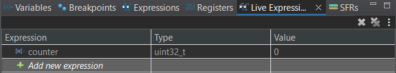

Далее нажимаем кнопку **Resume** , программа начнет выполняться и мы сможем наблюдать, как наша переменная увеличивается при нажатии на кнопку.

Отлично, но что если бы данные за которыми мы следили были бы не целыми или например изменяли знак и резко менялись, наблюдать за нами было бы гораздо приятнее на графике. Давайте сделаем это:

Первым делом выходим из отладчика, нажав кнопку **Terminate** 

Далее настроим Дебаггер 

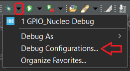

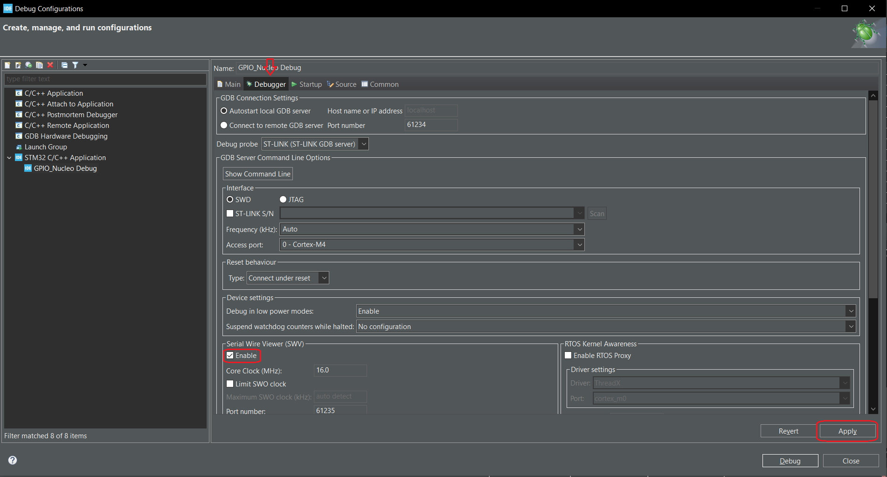

Ставим галочку ⇒ нажимаем **Apply** ⇒ **Close**

Далее заходим в отладчик и включаем сам график 

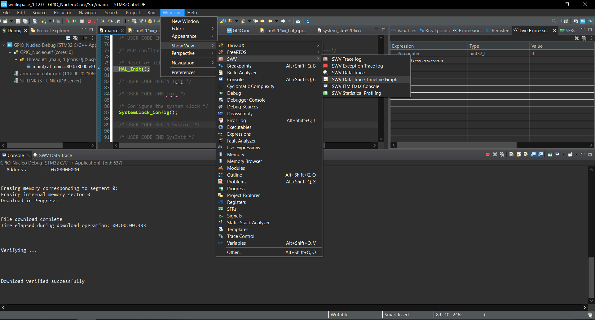

Должна появиться вкладка **SWV Data Trace Timeline Graph**, заходим в нее нажимаем на значок инструментов

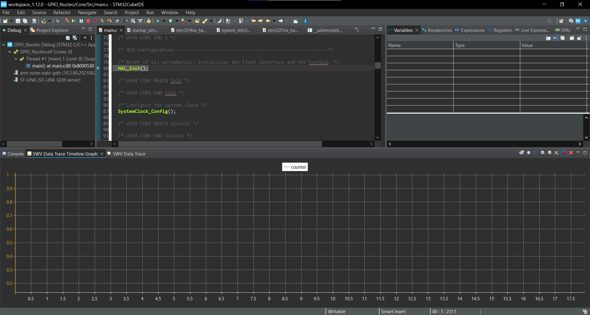

тут ставим галочку и пишем название переменной, которую хотим отобразить на графике

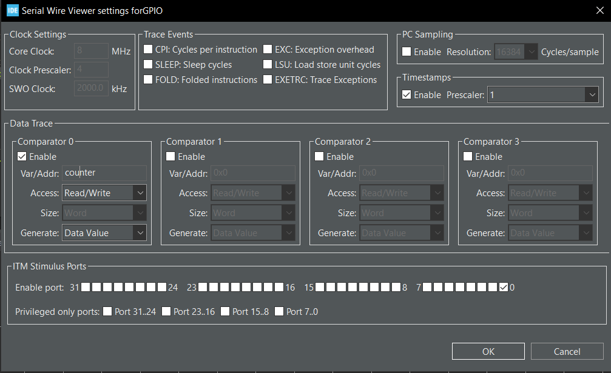

нажимаем OK

далее **Resume** 

и следим как значение counter увеличивается на графике при нажатии на кнопку

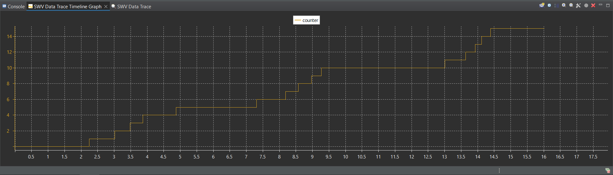
