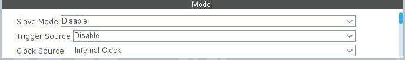
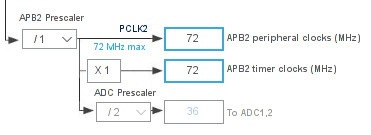
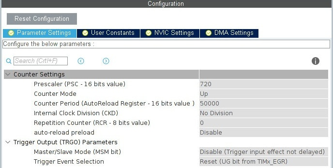
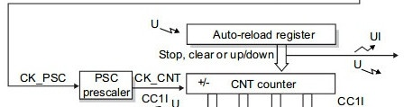
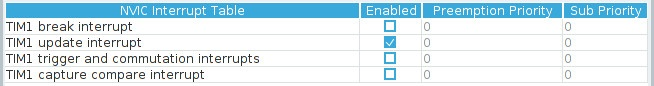

# Timers
Таймеры представляют собой потрясающее устройство, доступное в микроконтроллерах. Они позволяют измерять временные интервалы, длину импульсов, подсчитывать импульсы, генерировать ШИМ-сигналы, запускать один таймер от другого, активировать определенные периферийные устройства, запускать ракеты в космос и многое другое. Особенность заключается в том, что все эти операции выполняются на аппаратном уровне, обходя процессор.

Таймеры stm32 делятся на три вида:

Advanced-control timers (TIM1 и TIM8) — самые «нафаршированные».
General-purpose timers (TIM2, TIM3, TIM4, TIM5) — функционал чуть меньше чем у предыдущих.
Basic timers (все остальные) — сильно урезанный функционал.


Описание сделано на примере таймера №1.

Начнём с самого простого — выполнение какого-нибудь действия через определённые промежутки времени. Таймер будет каждые 500мс генерировать прерывание и мигать светодиодом в обработчике.

На всякий случай:
- мс — миллисекунда (1000мс = 1сек).
- мкс — микросекунда (1000000мкс = 1сек).
- нс — наносекунда (1000000000нс = 1сек)

> [!NOTE]
> В дальнейшем будем говорит о частоте тактирования и периоде. Стоит понимать, что время одного такта  $\tau = 1/\vartheta$ , где $\vartheta$ - это частота тактирования. Период (T) это время за которое проходит N тактов, то есть $T = N * \tau$

Первым делом нужно выбрать источник тактирования…

Clock Source ⇨ Internal Clock — в данном случае источник будет внутренний — частота от шины APB2…



Далее настраиваем таймер…



<details>
  <summary>Prescaler</summary>

    Prescaler — предделитель системной частоты таймера (частоты поступающей с шины APB2).

    Предделитель это цифровой счётчик, который считает между тиками таймера. То есть, допустим мы установили предделитель равным какому-то значению, тогда между каждым тиком таймера, счётчик предделителя будет со скоростью системной частоты таймера отсчитывать от 0 до этого значения и обнуляться. При каждом обнулении счётчика, таймер будет совершать очередной тик. Таким образом происходит деление частоты.

    Поскольку в цифровых счётчиках отсчёт начинается с нуля (0, 1, 2, 3...), то предделитель нужно указывать с вычетом единички. При значении Prescaler = 0, коэфф.деления = 1:1. При Prescaler = 1, коэфф.деления = 1:2.
    То есть, чтобы разделить частоту на 2, нужно в Prescaler записать 1, чтобы разделить частоту на 3, нужно в Prescaler записать 2, и т.д. То есть в нашем случае чтоб получить частоту 100кГц нужно указать Prescaler 719.

> [!NOTE]
> В примерах я округляю значение для удобства восприятия информации, но в рабочих проектах обязательно вычитайте единичку.
  
</details>

<details>
  <summary>Counter Mode</summary>

- Up — счётчик будет считать «вверх», от нуля до значения переполнения.

- Down — счётчик будет считать «вниз», от значения переполнения до нуля.

- Режимы Center Aligned описаны в разделе про ШИМ.
  
</details>

<details>
  <summary>Counter Period</summary>
 
    Counter Period — переполнение. Счётчик будет считать до 50000. При частоте 100кГц он досчитает до 50000 за 500мс.

    Здесь такая же ситуация как и с Prescaler'ом, нужно вычитать единичку из значения. То есть вместо 50000, нужно писать 49999.

</details>

<details>
  <summary>Internal Clock Division</summary>
  
    Делитель системной частоты таймера для формирования вспомогательного тактового сигнала, который используется в цифровых фильтрах, и для формирования времени запаздывания при работе в режиме PWM с комплементарными выходами (dead-time). Смотрите пункт про цифровой фильтр.
  
</details>

<details>
  <summary>Repetition Counter</summary>

    Если указать число больше нуля, то прерывание будет генерироваться не при каждом переполнение счётчика, а на каждые N переполнений. Например, если указываем 4, то прерывание будет вызываться при каждом четвёртом переполнении.
  
</details>

<details>
  <summary>auto-reload preload</summary>

    У некоторых регистров таймера есть дублирующие регистры, основной регистр называется «теневым» (на схема его рисуют с тенью, доступ из программы к нему невозможен), а дублирующий называется буферным регистром. Запись в теневой регистр производится через буферный — записали новое значение в буферный регистр, а оттуда оно переносится в теневой.



    Регистр ARR — Auto-reload register (в нём хранится значение переполнения, в нашем случае это — 50000).

    Когда мы изменяем значение переполнения, то новое значение записывается в буферный регистр, а дальше происходит следующее: если указано Disable, то новое значение тут же переносится в теневой регистр, а если указать Enable, то новое значение перенесётся в теневой регистр только после того, как таймер переполнится. Таким образом можно защитится от несвоевременного изменения значения, когда это значение нужно менять по ходу программы.
  
</details>


Теперь включите прерывание…



TIM1 update interrupt — прерывание при переполнении. Счётчик переполнился и обновился (update).

Перед бесконечным циклом запустим таймер в режиме прерывания:

```
/* USER CODE BEGIN 2 */
HAL_TIM_Base_Start_IT(&htim1);
/* USER CODE END 2 */
```

В колбеке мигаем светиком:

```
/* USER CODE BEGIN 0 */
void HAL_TIM_PeriodElapsedCallback(TIM_HandleTypeDef *htim)
{
        if(htim->Instance == TIM1) //check if the interrupt comes from TIM1
        {
                HAL_GPIO_TogglePin(led13_GPIO_Port, led13_Pin); 
        }
}
```

Это самое распространённое использование таймера — выполнение каких-либо действий через определённые интервалы времени.
