# Timers

[Видео лекция. Часть 1](https://www.youtube.com/watch?v=7iBBkNumYlo&list=PLhtMaaf_npBzsEQ94eGn5RnuE-VdGVObR&index=8)

[Видео лекция. Часть 2](https://www.youtube.com/watch?v=hmySSeW2ifI)

Таймеры представляют собой потрясающее устройство, доступное в микроконтроллерах. Они позволяют измерять временные интервалы, длину импульсов, подсчитывать импульсы, генерировать ШИМ-сигналы, запускать один таймер от другого, активировать определенные периферийные устройства, запускать ракеты в космос и многое другое. Особенность заключается в том, что все эти операции выполняются на аппаратном уровне, обходя процессор.

Таймеры stm32 делятся на три вида:

Advanced-control timers (TIM1 и TIM8) — самые «нафаршированные».
General-purpose timers (TIM2, TIM3, TIM4, TIM5) — функционал чуть меньше чем у предыдущих.
Basic timers (все остальные) — сильно урезанный функционал.


Описание сделано на примере таймера №1.

Начнём с самого простого — выполнение какого-нибудь действия через определённые промежутки времени. Таймер будет каждые 500мс генерировать прерывание и мигать светодиодом в обработчике.

На всякий случай:
- мс — миллисекунда (1000мс = 1сек).
- мкс — микросекунда (1000000мкс = 1сек).
- нс — наносекунда (1000000000нс = 1сек)

> [!NOTE]
> В дальнейшем будем говорит о частоте тактирования и периоде. Стоит понимать, что время одного такта  ꚍ = 1/ϑ , где ϑ - это частота тактирования. Период (T) это время за которое проходит N тактов, то есть T = N * ꚍ

Первым делом нужно выбрать источник тактирования…

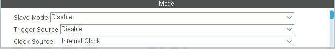

Clock Source ⇨ Internal Clock — в данном случае источник будет внутренний — частота от шины APB2…

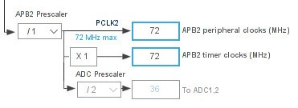


Далее настраиваем таймер…

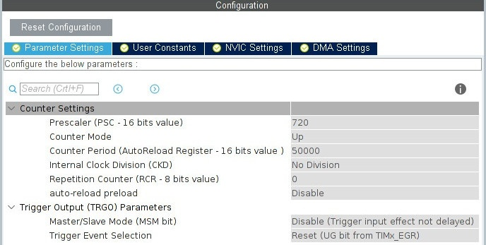


<details>
  <summary>Prescaler</summary>

```
Prescaler — предделитель системной частоты таймера (частоты поступающей с шины APB2).

Предделитель это цифровой счётчик, который считает между тиками таймера. То есть, допустим мы установили предделитель равным какому-то значению, тогда между каждым тиком таймера, счётчик предделителя будет со скоростью системной частоты таймера отсчитывать от 0 до этого значения и обнуляться. При каждом обнулении счётчика, таймер будет совершать очередной тик. Таким образом происходит деление частоты.

Поскольку в цифровых счётчиках отсчёт начинается с нуля (0, 1, 2, 3...), то предделитель нужно указывать с вычетом единички. При значении Prescaler = 0, коэфф.деления = 1:1. При Prescaler = 1, коэфф.деления = 1:2.
То есть, чтобы разделить частоту на 2, нужно в Prescaler записать 1, чтобы разделить частоту на 3, нужно в Prescaler записать 2, и т.д. То есть в нашем случае чтоб получить частоту 100кГц нужно указать Prescaler 719.
```

> [!NOTE]
> В примерах я округляю значение для удобства восприятия информации, но в рабочих проектах обязательно вычитайте единичку.
  
</details>

<details>
  <summary>Counter Mode</summary>

```
⇒ Up — счётчик будет считать «вверх», от нуля до значения переполнения.

⇒ Down — счётчик будет считать «вниз», от значения переполнения до нуля.

⇒ Режимы Center Aligned описаны в разделе про ШИМ.

```

</details>

<details>
  <summary>Counter Period</summary>
 
``` 
Counter Period — переполнение. Счётчик будет считать до 50000. При частоте 100кГц он досчитает до 50000 за 500мс.

Здесь такая же ситуация как и с Prescaler'ом, нужно вычитать единичку из значения. То есть вместо 50000, нужно писать 49999.

```

</details>

<details>
  <summary>Internal Clock Division</summary>

```  
Делитель системной частоты таймера для формирования вспомогательного тактового сигнала, который используется в цифровых фильтрах, и для формирования времени запаздывания при работе в режиме PWM с комплементарными выходами (dead-time). Смотрите пункт про цифровой фильтр.

```
  
</details>

<details>
  <summary>Repetition Counter</summary>

```
Если указать число больше нуля, то прерывание будет генерироваться не при каждом переполнение счётчика, а на каждые N переполнений. Например, если указываем 4, то прерывание будет вызываться при каждом четвёртом переполнении.
```  

</details>

<details>
  <summary>auto-reload preload</summary>

```
У некоторых регистров таймера есть дублирующие регистры, основной регистр называется «теневым» (на схема его рисуют с тенью, доступ из программы к нему невозможен), а дублирующий называется буферным регистром. Запись в теневой регистр производится через буферный — записали новое значение в буферный регистр, а оттуда оно переносится в теневой.
```

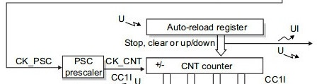

```
Регистр ARR — Auto-reload register (в нём хранится значение переполнения, в нашем случае это — 50000).

Когда мы изменяем значение переполнения, то новое значение записывается в буферный регистр, а дальше происходит следующее: если указано Disable, то новое значение тут же переносится в теневой регистр, а если указать Enable, то новое значение перенесётся в теневой регистр только после того, как таймер переполнится. Таким образом можно защитится от несвоевременного изменения значения, когда это значение нужно менять по ходу программы.

```
</details>


Теперь включите прерывание…

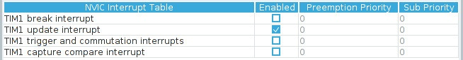

TIM1 update interrupt — прерывание при переполнении. Счётчик переполнился и обновился (update).

Перед бесконечным циклом запустим таймер в режиме прерывания:

```
/* USER CODE BEGIN 2 */
HAL_TIM_Base_Start_IT(&htim1);
/* USER CODE END 2 */

```

В колбеке мигаем светиком:

```
/* USER CODE BEGIN 0 */
void HAL_TIM_PeriodElapsedCallback(TIM_HandleTypeDef *htim)
{
        if(htim->Instance == TIM1) //check if the interrupt comes from TIM1
        {
                HAL_GPIO_TogglePin(led13_GPIO_Port, led13_Pin); 
        }
}
```
Это самое распространённое использование таймера — выполнение каких-либо действий через определённые интервалы времени.

## Каналы таймера ## 

Теперь давайте познакомимся с каналами таймера.

У каждого таймера есть четыре независимых канала, которые могут подключаться к физическим пинам микроконтроллера, то есть работать как внешние входы/выходы, а могут и не подключаться, и работать как внутренние входы/выходы для взаимодействия с другими таймерами. У некоторых МК, например у F303, есть доп. каналы (5 и 6) не имеющие выхода наружу.

Поэкспериментируем с первым каналом в режиме выхода — Output Compare. В этом режиме можно устанавливать уровень (HIGH или LOW) на выводной пин. Уровень переключается в момент сравнения. В этот момент можно генерировать прерывание.

Удалите все прежние настройки таймера и сделайте так…

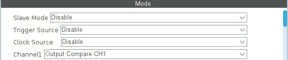

Указываем режим Output Compare для первого канала. Если в этом режиме не указывать источник тактирования, то по умолчанию используется системная частота таймера.

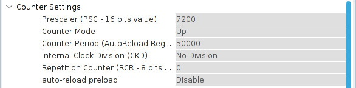

Здесь устанавливаем предделитель 7200, а переполнение 50000. Таким образом переполнение будет происходить каждые 5 сек.

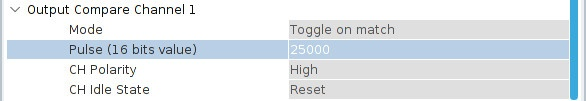

Mode ⇨ Toggle on match — в момент сравнения, на пине PA8 (TIM1_CH1) будет происходить смена уровня с HIGH на LOW и наоборот. В данном режиме не важно какое указано сравнение, главное чтоб оно было больше нуля и меньше (или равным) переполнения (50000).

</details>

<details>
  <summary>Другие варианты</summary>

```
⇒ Frozen — в момент сравнения состояние выхода не изменяется. Таймер в этом режиме может использоваться для того, чтобы формировать интервалы времени в программе (прерывания по сравнению).

⇒ Active Level on match — в момент сравнения на выход подаётся HIGH и больше не изменяется.

⇒ Inactive Level on match - в момент сравнения на выход подаётся HIGH и больше не изменяется.

⇒ Inactive Level on match — в момент сравнения на выход подаётся LOW и больше не изменяется.

⇒ Forced Active — на выход сразу же (независимо от значений переполнения и сравнения) подаётся HIGH и больше не изменяется.

⇒ Forced Inactive — на выход сразу же (независимо от значений переполнения и сравнения) подаётся LOW и больше не изменяется.
```
</details>
<br>
Pulse — здесь вписывается значение сравнения. В данном случае прерывание по сравнению будет происходить когда счётчик досчитает до 25000.

Сейчас сгенерируйте проект, подключите к PA8 светодиод, а в коде впишите (перед бесконечным циклом) команду…

```
/* USER CODE BEGIN 2 */
HAL_TIM_OC_Start_IT(&htim1, TIM_CHANNEL_1); // генерирует прерывание
//HAL_TIM_OC_Start(&htim1, TIM_CHANNEL_1); // не генерирует прерывание
/* USER CODE END 2 */
```

Таймер запускается в режиме Output Compare для канала №1.

Прошейте и нажмите кнопочку Reset. Светодиод загорится через 2.5 секунды, то есть после того как счётчик досчитает до сравнения. Если же изменить полярность сигнала — CH Polarity ⇨ Low, то после Reset'а светик загорится сразу же, а погаснет через 2.5 секунды. То есть этот пункт позволяет выбрать — когда будет устанавливаться высокий уровень на линии, до сравнения или после.

CH Idle State — определяет логический уровень сигнала на выходе канала в состоянии ожидания (пока не трогайте).


Если нужно чтоб в момент сравнения генерировалось прерывание, то его нужно активировать…

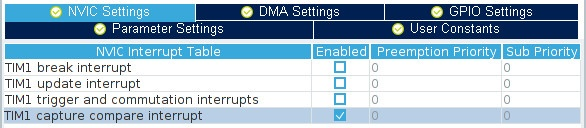

А в программу добавить колбек…

```
void HAL_TIM_OC_DelayElapsedCallback(TIM_HandleTypeDef *htim)
{
        if(htim->Instance == TIM1)
        {
                HAL_GPIO_TogglePin(led13_GPIO_Port, led13_Pin);
                snprintf(trans_str, 31, "Compare %lu\n", __HAL_TIM_GET_COUNTER(&htim1));
                HAL_UART_Transmit(&huart1, (uint8_t*)trans_str, strlen(trans_str), 1000);
        }
}

```

> [!NOTE]
> На строчки ```snprintf(trans_str, 31, "Compare %lu\n", __HAL_TIM_GET_COUNTER(&htim1));``` и ```                HAL_UART_Transmit(&huart1, (uint8_t*)trans_str, strlen(trans_str), 1000);``` пока не особо обращайте внимания, они нужны для отправки данных на компьютер с микроконтроллера, это будет описано в следующей лабе.

## PWM - ШИМ ##

ШИМ (PWR) — это разновидность режима сравнения.

ШИМ (широтно-импульсная модуляция) — это метод управления сигналом, который используется для управления мощностью или скоростью электрического устройства. Он основан на генерации серии импульсов, называемых широтно-импульсными сигналами, с различной длительностью.

Вот графики, демонстрирующие работу ШИМ с разной [скважностью](https://ru.wikipedia.org/wiki/%D0%A1%D0%BA%D0%B2%D0%B0%D0%B6%D0%BD%D0%BE%D1%81%D1%82%D1%8C):

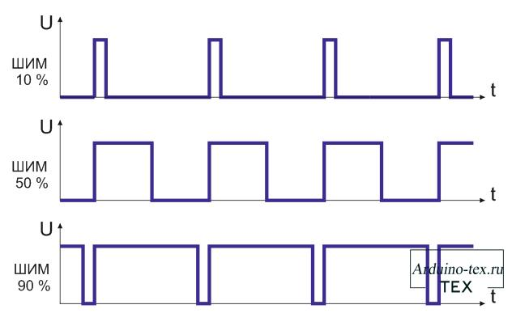

<br>
На графике представлены импульсы ШИМ. Они имеют разную длительность во времени. Длительность каждого импульса определяет, насколько долго будет активным выходной сигнал. Если импульс длится долго, то выходной сигнал будет активным на протяжении большей части времени. Если импульс короткий, то выходной сигнал будет активным только на короткое время.

Преимущество ШИМ заключается в том, что он позволяет управлять мощностью устройства или скоростью двигателя, изменяя отношение между временем активности и неактивности сигнала. Это делает ШИМ очень полезным для управления яркостью светодиодов, скоростью электродвигателей, углом поворота сервопривода.

Удалите всё что настроено и сделайте так…

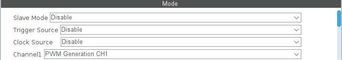

Указываем режим PWM (ШИМ) для первого канала. Если в этом режиме не указывать источник тактирования, то по умолчанию используется системная частота таймера.

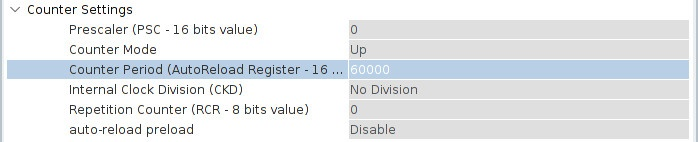

Предделитель по нулям, пущай жарит на всю катушку, а переполнение делаем 60000.

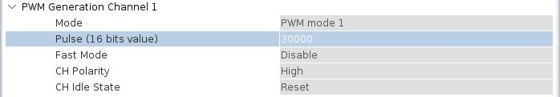

- Pulse — в режиме ШИМ, сравнением мы устанавливаем коэффициент заполнения, то есть продолжительность высокого уровня (длина импульса). В данном случае коэффициент заполнения будет 50%. Если указать сравнение 15000, то коэффициент заполнения будет 25%.

- CH Polarity ⇨ High — полярность сигнала. Если в режиме Output Compare при значении High светодиод загорался после перехода через сравнение, то в режиме PWR Generation всё наоборот, сначала подаётся высокий уровень, а после перехода через сравнение низкий. Полярность сигнала можно менять не только в этом пункте, но и в пункте Mode ⇨ PWM mode (см. ниже).


Таким образом у нас получается: период — 60000, а длина импульса — 30000. То есть мы получим вот такой ШИМ…

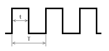

- t — длина импульса.
- T — период.

Период будет равен ~840мкс (на частоте 72мГц один тик таймера выполняется за ~14нс, значит 14 * 60000 = 840000нс = 840мкс).

В программе добавьте запуск ШИМа:

```
/* USER CODE BEGIN 2 */
HAL_TIM_PWM_Start_IT(&htim1, TIM_CHANNEL_1);
/* USER CODE END 2 */
```
Светик будет гореть в половину накала.


Чтобы светик плавно разгорался и затухал, надо сделать так…

```
/* USER CODE BEGIN 2 */
  HAL_TIM_PWM_Start_IT(&htim1, TIM_CHANNEL_1);
  uint16_t i = 0;
  volatile uint16_t j = 0;
  /* USER CODE END 2 */

  /* Infinite loop */
  /* USER CODE BEGIN WHILE */
  while (1)
  {
          for(i = 0; i <= 60000; i++)
          {
                  TIM1->CCR1 = i;
                  for(j = 0; j < 100; j++) __NOP();
          }

          HAL_Delay(500);

          for(i = 60000; i > 0; i--)
          {
                  TIM1->CCR1 = i;
                  for(j = 0; j < 100; j++) __NOP();
          }

          HAL_Delay(500);
          ...
```

Здесь ведётся работа напрямую с регистром сравнения первого канала **(CCR1)**, увеличивая, а потом уменьшая его значение. То есть мы плавно меняем значение 


Вместо работы с регистрами можно воспользоваться HALовскими макросами, например, в данном случае можно заменить строчки **TIM1->CCR1 = i;** на макрос **__HAL_TIM_SET_COMPARE(&htim1, TIM_CHANNEL_1, i);**

Различные макросы можно посмотреть в файле **stm32f1xx_hal_tim.h**


Чтобы генерить прерывание в конце импульса, надо его включить…


То же самое что и в режиме Output Compare.

И ловить в колбеке…

```
void HAL_TIM_PWM_PulseFinishedCallback(TIM_HandleTypeDef *htim)
{
        if(htim->Instance == TIM1)
        {
                HAL_GPIO_TogglePin(led13_GPIO_Port, led13_Pin);
        }
}
```

## Сервопривод ##

Выше был описан далеко не весь функционал таймера. Нам по большей мере нужен будет режим таймера PWM для работы с сервоприводом.

Мы будем использовать сервопривод MG90S, для начала посмотрим на его [datasheet](../../doc/MG90S_datasheet.pdf).

В первую очередь обратим внимание на подключение сервы:
- <font color="red">Красный</font> провод питания - <font color="red">5V</font> (можно взять напрямую у st-link v2)
- <font color="brown">Коричневый</font> - <font color="brown">GND</font> (есть на плате BluePill)
- <font color="orange">Оранжевый</font> - на него будем подавать <font color="orange">PWM сигнал</font>

Подключаем питание и землю ⇒ создаем проект сервы в CubeIde:

Включаем интерфейс отладки Serial Wire ⇒ активируем TIM2 CHANNEL 1 как выход PWM ⇒ настраиваем Prescaler и Counter Period:

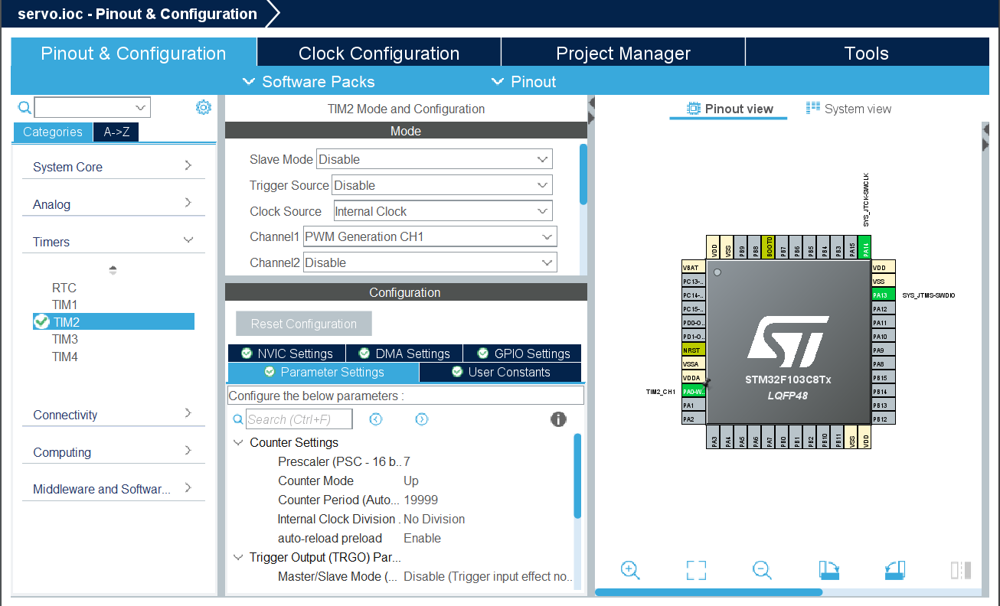

Поделим частоту тактирования таймера (8 MHz) на 8 ⇒ получаем частоту 1 MHz.

По datasheet на серву период ШИМ сигнала должен быть 20мс.

Так как частота тактирования 1 MHz значит время одного тика таймера 1мкс, мы хотим, чтобы период был 20мс, то есть в одном периоде должно быть X количество счетов, так, чтобы 1мкс * X = 20мс **⇒** X = $\frac{20 \times 10^{-3}}{1 \times 10^{-6}}$

Количество счетов X это и есть Counter Period, а Prescaler - делитель частоты, который в нашем случае равен 8.

> [!NOTE]
> Мы определили, что Prescaler = 8, а Counter Period = 20 000, но в соответствующие поля в CubeMx нужно писать: ***(высчитанное значение) - 1*** (так мы и сделали, смотри скриншот выше)

Теперь выставим pulse:

Для корректного вращения сервы от -90° до 90° нужно, чтобы время положительного сигнала на выходе таймера было 0,5-2,5 мс за период, следовательно если пересчитать это в тики, то это составит от 500 до 2500 тиков. Количество тиков до изменения фронта сигнала это pulse (полярность оставляем High).

На рисунке ниже показано, что значение pulse записывается в регистр CCRx (где x - номер канала соответствующего таймера), а в ARR лежит значение Counter Period.

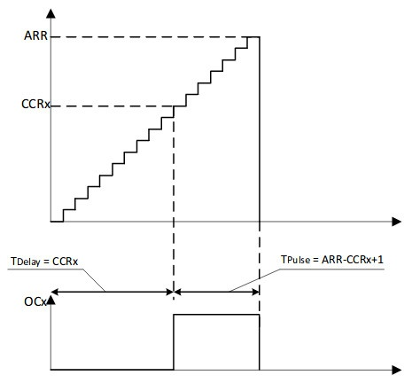

<br>

Установим pulse в разделе PWM Generation Channel 1:

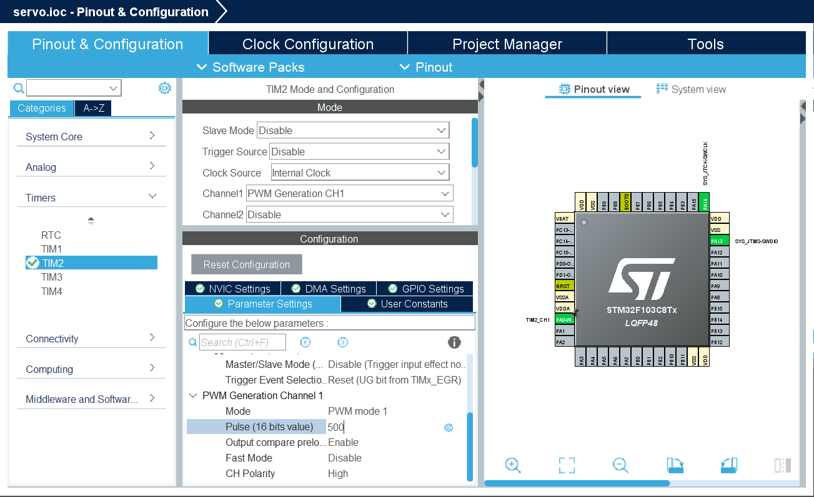

С настройками CubeMx все, теперь перейдем к коду:

Для начала запустим таймер в режиме PWM:

```
/* USER CODE BEGIN 2 */
  HAL_TIM_PWM_Start(&htim2, TIM_CHANNEL_1);
  /* USER CODE END 2 */
```

Далее в бесконечном цикле будем изменять pulse от минимального (500) значения до максимального (2500) и обратно:

```
for(int i = 500; i < 2500; i += 10){
        TIM2->CCR1 = i;
        HAL_Delay(10);
}
for(int i = 2500; i > 500; i -= 10){
        __HAL_TIM_SET_COMPARE(&htim2,TIM_CHANNEL_1,i);
        HAL_Delay(10);
}
```

Как видите из кода можно изменять pulse двумя способами:
- напрямую изменять значение регистра CCR ***TIM2->CCR1 = i;***
- воспользоваться макросом HAL ***__HAL_TIM_SET_COMPARE(&htim2,TIM_CHANNEL_1,i);***

Так как серва не мгновенно выходит в требуемое положение, а наш бесконечный цикл ***while*** очень быстрый, то добавим задержки после каждого изменения pulse на 10 мс. 

Далее собираем проект и заливаем его на плату.

Если вы все сделали верно, то серва должна изменять свое положение от -90° до 90°.

### Используемые функции HAL ###
- HAL_TIM_Base_Start(&htim1);
- HAL_TIM_Base_Start_IT(&htim1);
- HAL_TIM_PWM_Start(&htim2, TIM_CHANNEL_1);
- HAL_TIM_PWM_Start_IT(&htim1, TIM_CHANNEL_1);
- HAL_TIM_OC_Start(&htim1, TIM_CHANNEL_1);
- HAL_TIM_OC_Start_IT(&htim1, TIM_CHANNEL_1);
- HAL_GPIO_TogglePin(led13_GPIO_Port, led13_Pin);

### Используемые макросы HAL ###
- __HAL_TIM_GET_COUNTER(&htim1);
- __HAL_TIM_SET_COMPARE(&htim2,TIM_CHANNEL_1,i);

### Обращение к регистрам ###
- TIM2->CCR1 = i;

## Самостоятельная работа ##

Напишите код, где серва будет поворачиваться на угол 90° по нажатию на кнопку, ждать секунду и возвращаться в исходное положение.