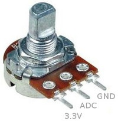
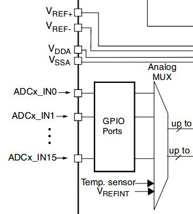
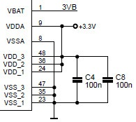
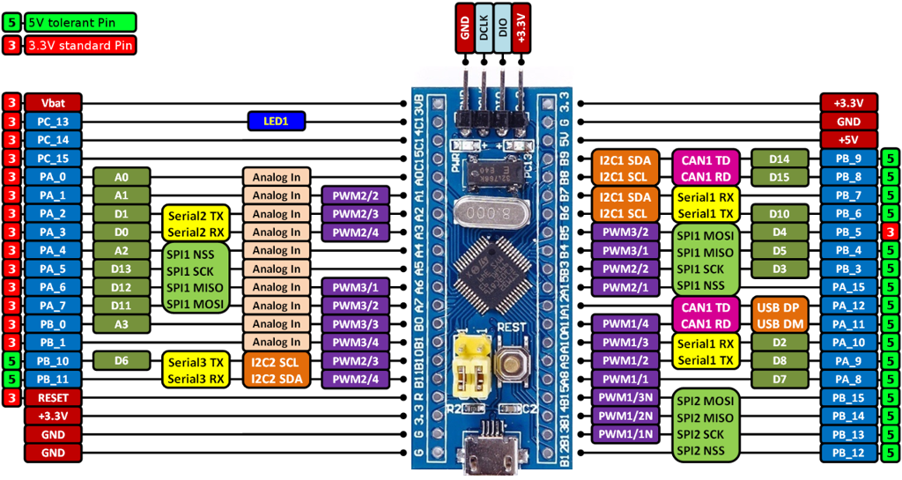
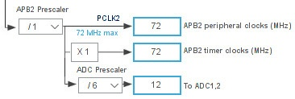
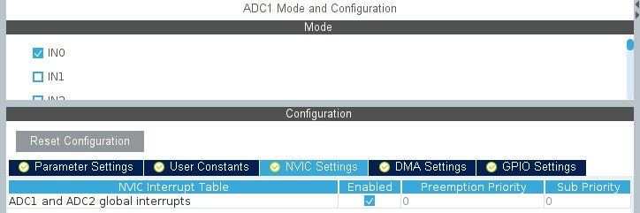
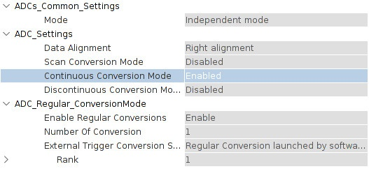
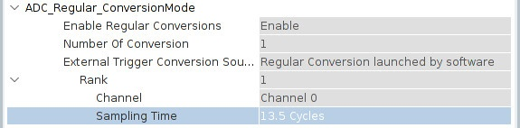

# АЦП 

## Видео лекции ##

### Теория ### 
- [Что такое АЦП. Часть 1](https://www.youtube.com/watch?v=Rogey4YVjaw&list=PLP3ZxgNn8T5LWXRQ_zDEIBWU6aNSY5KWb&index=25)
- [Что такое АЦП. Часть 2](https://www.youtube.com/watch?v=4OJ8Pvh7hIk&list=PLP3ZxgNn8T5LWXRQ_zDEIBWU6aNSY5KWb&index=26)
- [Что такое АЦП. Часть 3](https://www.youtube.com/watch?v=pRRBu5ZS69o&list=PLP3ZxgNn8T5LWXRQ_zDEIBWU6aNSY5KWb&index=27)
- [Что такое АЦП. Часть 4](https://www.youtube.com/watch?v=Oz--ghdBqN4&list=PLP3ZxgNn8T5LWXRQ_zDEIBWU6aNSY5KWb&index=28)

### АЦП в stm32 ###
- [АЦП и ЦАП в stm32](https://www.youtube.com/watch?v=_fCVWvL6Eq8&list=PLhtMaaf_npBzsEQ94eGn5RnuE-VdGVObR&index=15)

## Теория ##

**АЦП** (аналого-цифровой преобразователь) — это электронное устройство, которое преобразует аналоговый сигнал (например, звуковые волны или изменения температуры) в цифровой формат, понятный компьютерам. Для лучшего понимания, представим, что у нас есть магическая шкатулка, которая умеет переводить слова в числа.

Вот как это работает:

**Шаг 1**: Замер аналогового сигнала  
   Допустим, у нас есть аналоговый сигнал, например, звуковая волна. АЦП берет этот сигнал и измеряет его значение в определенный момент времени.

**Шаг 2**: Квантование  
   Затем АЦП разбивает измеренное значение на отдельные кусочки, как если бы мы разбивали лузгу на кусочки.

**Шаг 3**: Дискретизация  
   После этого каждый кусочек преобразуется в цифровое значение, чтобы компьютер мог его понять. Это похоже на то, как мы переводим слова в числа с помощью магической шкатулки.

**Шаг 4**: Передача данных  
   Наконец, цифровые значения передаются компьютеру для обработки и анализа.


## Практика ##

Для прохождения данной лабораторной работы вам понадобится:
- отладочная плата BluePill
- потенциометр



<br>

Итак, у нас есть два АЦП (ADC1 и ADC2) на других платах их может быть больше. Ножки обоих АЦП подключены к одному мультиплексору…



[Reference manual RM0008](./doc/reference_manual.pdf) стр. 217

Vref — опорное напряжение для АЦП. У описываемой платы этих входов нет. Схема питания выглядит так…



У BluePill в общей сложности можно настроить 10 аналоговых входов…



Работу АЦП можно условно разделить на два режима — «Независимый» и «Парный». В первом случае можно запускать АЦП1 и АЦП2 (с любыми выбранными каналами) независимо друг от друга (это обычный режим), а во втором можно сделать так, что один АЦП будет запускать другой, либо оба АЦП настроить на работу с одной и той же ножкой (далее канал).

Каналы АЦП можно настроить как регулярные (regular channels), и как инжектированные (Injected channels).

Суть инжектированного канала заключается в том, что у него есть своя отдельная ячейка для сохранения результата. То есть если каналы РА0, РА1, РА2, РА3 настроить как инжектированные, то результаты будут сохранены в четыре разные ячейки.
Инжектированных каналов может быть не больше четырёх. Любой аналоговый вход можно настроить как инжектированный.
У инжектированных каналов есть приоритет над регулярными. То есть если запустить преобразование регулярных каналов, и запустить преобразование инжектированных, то преобразование регулярных будет прервано (а потом продолжено) на время преобразования инжектированных.

У регулярных каналов всего одна ячейка на всех. То есть если каналы РА0, РА1, РА2, РА3 настроить как регулярные, то результат работы каждого канала будет записываться в одну и ту же ячейку, затирая предыдущие данные. Своевременно забирать результаты нам поможет DMA.

Помимо внешних входов АЦП, есть ещё два внутренних. Один подключён к встроенной термопаре, а другой измеряет напряжение питания МК.

-----------------------------------------------------------

Сначала будем работать с регулярными каналами, а потом с инжектированными.


Создадим проект в CubeMX…


Настройте тактирование ADC (ADC Prescaler)…



Частота АЦП не должна превышать 14МГц.


Инициализируйте ADC1…


На вход ADC_IN0 (PA0) нужно подать считываемый сигнал, а в UART будем выводить показания.

<br>

В main.c добавьте хедер:

<br>

```
/* USER CODE BEGIN Includes */
#include "string.h" // это для функции strlen()
/* USER CODE END Includes */
```

Пару глобальных переменных:

```
/* USER CODE BEGIN PV */
char trans_str[64] = {0,};
uint16_t adc = 0;
/* USER CODE END PV */
```


Перед бесконечным циклом добавляем калибровку АЦП:

```
/* USER CODE BEGIN 2 */
HAL_ADCEx_Calibration_Start(&hadc1);
/* USER CODE END 2 */
```


И в бесконечный цикл добавьте следующий код:

```
/* Infinite loop */
  /* USER CODE BEGIN WHILE */
  while (1)
  {
          HAL_ADC_Start(&hadc1); // запускаем преобразование сигнала АЦП
          HAL_ADC_PollForConversion(&hadc1, 100); // ожидаем окончания преобразования
          adc = HAL_ADC_GetValue(&hadc1); // читаем полученное значение в переменную adc
          HAL_ADC_Stop(&hadc1); // останавливаем АЦП (не обязательно)
          snprintf(trans_str, 63, "ADC %d\n", adc);
          HAL_UART_Transmit(&huart1, (uint8_t*)trans_str, strlen(trans_str), 1000);
          HAL_Delay(1000);
    /* USER CODE END WHILE */

    /* USER CODE BEGIN 3 */
  }
```


Прошивайте и смотрите результат. Вы должны получить значение от 0 до 4095 (АЦП у нас 12-ти битный).


<details>
  <summary>про АЦП2</summary>

Чтобы читать данные со второго АЦП нужно просто изменить hadc1 на hadc2 (предварительно активировав какой-нибудь канал).

```
/* Infinite loop */
  /* USER CODE BEGIN WHILE */
  while (1)
  {
          HAL_ADC_Start(&hadc1); // запускаем преобразование сигнала АЦП
          HAL_ADC_PollForConversion(&hadc1, 100); // ожидаем окончания преобразования
          adc = HAL_ADC_GetValue(&hadc1); // читаем полученное значение в переменную adc
          HAL_ADC_Stop(&hadc1); // останавливаем АЦП
          snprintf(trans_str, 63, "ADC %d\n", adc);
          HAL_UART_Transmit(&huart1, (uint8_t*)trans_str, strlen(trans_str), 1000);

          uint16_t adc2 = 0;
          HAL_ADC_Start(&hadc2); 
          HAL_ADC_PollForConversion(&hadc2, 100); 
          adc2 = HAL_ADC_GetValue(&hadc2);
          HAL_ADC_Stop(&hadc2); 
          snprintf(trans_str, 63, "ADC %d\n", adc2);
          HAL_UART_Transmit(&huart1, (uint8_t*)trans_str, strlen(trans_str), 1000);

          HAL_Delay(1000);
    /* USER CODE END WHILE */

    /* USER CODE BEGIN 3 */
  }
```

Далее (до определённого момента) все примеры будут для первого АЦП.
</details>

<br>

Чтоб программа не тормозилась в ожидании результата, воспользуемся прерыванием по окончании преобразования.

Активируйте глобальное прерывание и сгенерируйте проект…



Добавьте колбек, в котором результат будет копироваться в переменную:

```
/* USER CODE BEGIN 0 */
void HAL_ADC_ConvCpltCallback(ADC_HandleTypeDef* hadc)
{
    if(hadc->Instance == ADC1) //check if the interrupt comes from ACD1
    {
        adc = HAL_ADC_GetValue(&hadc1);
    }
}
/* USER CODE END 0 */
```

После калибровки запустим АЦП:

```
/* USER CODE BEGIN 2 */
HAL_ADCEx_Calibration_Start(&hadc1);
HAL_ADC_Start_IT(&hadc1);
/* USER CODE END 2 */
```

В бесконечном цикле будем выводить результат и снова запускать АЦП:

```
while (1)
{
  snprintf(trans_str, 63, "ADC %d\n", (uint16_t)adc);
  HAL_UART_Transmit(&huart1, (uint8_t*)trans_str, strlen(trans_str), 1000);
  adc = 0;
  HAL_ADC_Start_IT(&hadc1);
  HAL_Delay(500);
  ...
```

<br>

Чтобы каждый раз не запускать АЦП, можно активировать режим циклического чтения каналов…



```
while (1)
{
  snprintf(trans_str, 63, "ADC %d\n", (uint16_t)adc);
  HAL_UART_Transmit(&huart1, (uint8_t*)trans_str, strlen(trans_str), 1000);
  adc = 0;
  //HAL_ADC_Start_IT(&hadc1);
  HAL_Delay(500);
  ...
```

В этом режиме АЦП будет стартовать автоматически после окончания предыдущего преобразования.

<details>
  <summary>тут есть один нюанс</summary>

Нужно увеличить время сэмплирования:



Если этого не сделать, то опрос АЦП будет происходить слишком быстро и программа будет постоянно висеть в прерывании. Подробно про сэмплирование написано ниже.

Другой вариант, это запускать АЦП без прерываний:

```
/* USER CODE BEGIN 2 */
HAL_ADCEx_Calibration_Start(&hadc1);
HAL_ADC_Start(&hadc1);
/* USER CODE END 2 */
```

В цикле делать так:

```
snprintf(trans_str, 63, "ADC %d\n", (uint16_t)HAL_ADC_GetValue(&hadc1));
HAL_UART_Transmit(&huart1, (uint8_t*)trans_str, strlen(trans_str), 1000);
```

Далее (до определённого момента) все примеры будут для первого АЦП.
</details>


</details>

<details>
  <summary>Independent mode</summary>
    Independent mode (независимый режим) — сейчас там нет возможности выбрать что-либо, однако если настроить АЦП_1 и АЦП_2, то появятся различные варианты («Парный режим» см. ниже).

</details>

<details>
  <summary>Data Alignment</summary>
    Data Alignment — выравнивание данных по левому или правому краю. Поскольку АЦП 12-разрядный, а регистры 16-разрядные, то предусмотрена возможность выравнивания результата измерения по левому или по правому краю этих регистров.

</details>

<details>
  <summary>Scan Conversion Mode</summary>
    Scan Conversion Mode — этот режим становится активным когда опрашиваются несколько каналов на одном АЦП.

</details>

<details>
  <summary>Continious Conversion Mode</summary>
    Continious Conversion Mode — опрос канала/каналов производится циклически (нет необходимости перезапуска).

</details>

<details>
  <summary>Discontinuous Conversion Mode</summary>
    Discontinuous Conversion Mode — этот режим позволяет сканировать несколько каналов (на одном АЦП) так, чтобы опрос происходил не по всем каналам сразу, а по одному, или по заранее заданным группам каналов (см. ниже).

</details>

<details>
  <summary>Enable Regular Conversions</summary>
    Enable Regular Conversions — Enable — каналы настроены как регулярные.
</details>

<br>

**Independent mode** (независимый режим) — сейчас там нет возможности выбрать что-либо, однако если настроить АЦП_1 и АЦП_2, то появятся различные варианты («Парный режим» см. ниже).

**Data Alignment** — выравнивание данных по левому или правому краю. Поскольку АЦП 12-разрядный, а регистры 16-разрядные, то предусмотрена возможность выравнивания результата измерения по левому или по правому краю этих регистров.

**Scan Conversion Mode** — этот режим становится активным когда опрашиваются несколько каналов на одном АЦП.

**Continious Conversion Mode** — опрос канала/каналов производится циклически (нет необходимости перезапуска).

**Discontinuous Conversion Mode** — этот режим позволяет сканировать несколько каналов (на одном АЦП) так, чтобы опрос происходил не по всем каналам сразу, а по одному, или по заранее заданным группам каналов (см. ниже).

**Enable Regular Conversions** — Enable — каналы настроены как регулярные.


