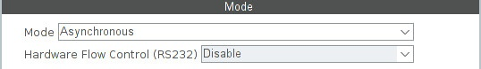
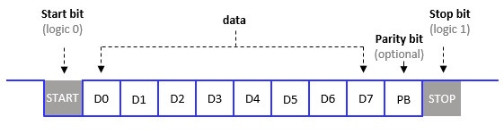
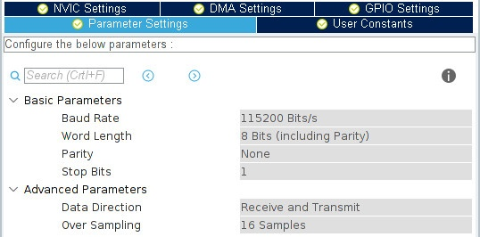

# USART

[Видео лекция](https://www.youtube.com/watch?v=zhOMC8MaYzU&list=PLhtMaaf_npBzsEQ94eGn5RnuE-VdGVObR&index=10)

**USART** (Universal Synchronous-Asynchronous Receiver/Transmitter) — универсальный синхронно-асинхронный приёмопередатчик, интерфейс для передачи данных между цифровыми устройствами. Он на столько универсальный, что даже провода по которым к вам домой приходит интернет, это тоже USART (RS485).

В нашем итоговом проекте USART понадобится нам для передачи денных от блока управления ракеты на наш компьютер. Забегая вперед общение с радиомодулем hc-12 осуществляется с помощью интерфейса USART.

USART микроконтроллера stm32 может работать в различных режимах — асинхронный, синхронный, полудуплекс и т.д.

Рассмотрим по подробнее асинхронный режим (UART)

## Asynchronous



Интерфейс UART использует два провода для передачи данных: один для отправки (TX) и один для приема (RX). Он работает в асинхронном режиме, что означает, что данные передаются без использования внутреннего тактового сигнала. 

На каждом модуле использующем интерфейс UART есть пины подписаные надписями TXD и RXD. Соединяя пины микроконтроллера настроенные на передачу данных по интерфейсу UART с пинами на модуле UART (USB_to_TTL или HC-12), пины TXD и RXD модуля должны быть подключены к Rx и Tx пинам микроконтроллера соответсвенно. T-transmit(пердавать) R-receive(принимать) когда один модуль передает данные, он как бы дергает провод своим выходом Transmit, принимающий же модуль улавливает эти импульсы своим входом Receive.

RX **<>** TX

TX **<>** RX

### Пакет данных
Данные передаются по проводам, на которых может быть либо положительное напряжение питания 3V3 (или HIGH - высокое состояние) либо земля GND (или LOW - низкое состояние). Поэтому все передающиеся данные представленны в двоичной системе исчисления, то есть это нули и еденицы. Нуль или еденица называется одим битом информации. Наши данные это и есть последовательность бит (нулей и едениц), физически это установдение 3V3 или GND на проводах TX или RX. 
Когда устройство отправляет данные, оно посылает каждый байт (8 бит) последовательно, начиная со стартого бита, далее биты данных, бит четности (если он используется), и наконец, стоп-бит. Приемное устройство считывает эти биты в правильной последовательности и принимает переданные данные.




### Старт- и Стоп-биты 

Передача каждого байта начинается со старт-бита, который устанавливается в логическую "0", чтобы указать начало передачи. Затем идут данные, после которых следуют биты четности (если они используются), и наконец, один или несколько стоп-битов, которые устанавливаются в логическую "1" и указывают конец передачи.

### Пример

Представим, что мы отправляем байт данных "01001011". Последовательность будет выглядеть так:
- Старт-бит: 0
- Данные: 01001011
- Бит четности (если используется)
- Стоп-бит: 1

Это позволяет приемнику правильно интерпретировать переданные данные.

## Настройки UART в CubeIde


Тут следует немного пояснить работу USART'а для упрощения понимания некоторых настроек.

Мы будем передавать 8-ми битные байты (в отдельных случаях байты могут 9-ти битные), на скорости 115200 бит в секунду…



- **Baud Rate** — скорость передачи (должна совпадать на обоих устройствах общения).
- **Word Length** — длина данных в педеющемся пакете.
- **Parity** — использование бита проверки чётности (см. ниже).
- **Stop Bits** — количество стоповых битов (1 или 2).
- **Data Direction** — включается приём и передача, или что-то одно.
- **Over Sampling** — см. ниже.

Получаемый пакет из восьми бит (один байт) выглядит так…


Отправляемые/получаемые байты отделяются друг от друга стартовыми и стоповыми битами.

Если ничего не передаётся, то линия находится в состоянии HIGH. Передатчик, начиная отправку, прижимает линию к «земле», а приёмник расценивает это как начало пакета — START (стартовый бит). Далее идёт приём (отсчитывая биты) и после последнего (D7) бита проверяется что линия установлена в HIGH — STOP (стоповый бит). Иногда для большей достоверности окончания приёма используются два стоповых бита.


Количество принятых бит подсчитывается следующим образом: как только появляется стартовый бит (переход с HIGH на LOW) сразу же начинается отсчёт — 16 тиков на каждый бит… (количество тиков это и есть **Over Sampling**)


**Parity** — бит чётности. С помощью этого бита можно проверять целостность полученного пакета.

Пакет с добавленным битом чётности выглядит так…


Word Length нужно указать 9 Bits. Если оставить 8 Bits, то полезных битов будет 7.

При отправке в этот бит записывается единица или ноль в зависимости от количества единичек в предыдущих восьми битах. Если единичек чётное кол-во, то записывается 0, если нечётное, то 1.

То есть:

Если отправляется 10111101 (шесть единичек — чётное количество), то бит чётности будет 0. Пакет будет выглядеть так — 101111010.

Если отправляется 01110011 (пять единичек — нечётное количество), то бит чётности будет 1. Пакет будет выглядеть так — 011100111.

При приёме такого пакета производится проверка — соответствует ли количество единичек значению в девятом бите, и если не соответствует, то пакет считается повреждённым — ошибка контроля чётности (HAL_UART_ERROR_PE).

Вычисления производятся с помощью битовой операции XOR (исключающее «или»).

Проверка конечно так себе. Теоретически может одна единичка превратится в ноль, а другой ноль в единичку, и тогда проверка ничего не выявит.

## Элементы кода 

> [!NOTE]
> Чтобы принять или отправить данные достаточно описанных выше настроек.

### Отправка данных
Отправить строку «Hello World» можно так:

>HAL_UART_Transmit(&huart1, (uint8_t*)"Hello World\n", 12, 1000);

- Первый аргумент — указатель на структуру USART
- Второй аргумент — строка (приведённая к указателю)
- Третий кол-во символов в отправляемой строке
- Четвёртый — таймаут в миллисекундах (если по каким-то причинам не удастся выполнить отправку в течении секунды, то вернётся ошибка).

Эта функция блокирующая, то есть пока она не выполнится программа будет приостановлена.


Чтоб не блокировать программу на время отправки, нужно воспользоваться функцией с прерыванием по завершению передачи.

Включите глобальное прерывание…


Отправлять данные так:

>HAL_UART_Transmit_IT(&huart1, (uint8_t*)"Hello World\n", 12);

Здесь нет таймаута так как нам ничего не нужно ждать — отправили и забыли. Остальные аргументы те же, что и у блокирующей функции.

По окончании отправки сработает прерывание и вызовет колбек:
```
void HAL_UART_TxCpltCallback(UART_HandleTypeDef *huart)
{
          if(huart == &huart1)
          {
                  // можно установить какой-то флаг, сообщающий об окончании отправки
          }     
}
```

Отправить массив:
```
/* USER CODE BEGIN Includes */
#include "string.h"
/* USER CODE END Includes */
...

char buff[16] = {0,};

snprintf(buff, 15, "Hello World\n");
HAL_UART_Transmit_IT(&huart1, (uint8_t*)buff, strlen(buff));
```
Второй аргумент — указатель на массив, третий — длина строки в массиве.


### Прием данных


Для приёма нужно сделать так:

```
uint8_t buff[16] = {0,};
HAL_UART_Receive(&huart1, (uint8_t*)buff, 15, 1000);
```
- Второй аргумент — указатель на массив в который будут записываться полученные данные
- Третий аргумент — кол-во байт, которые нужно принять
- Четвертый аргумент — таймаут.

Эта функция тоже блокирующая, она будет ожидать до тех пор пока не получит все запрошенные байты, или пока не истечёт таймаут.


Если для отправки данных блокирующая функция вполне подходит, то для приёма совсем не годится (мы ведь не знаем когда придут данные, если конечно они не идут сплошным потоком). Поэтому нужно использовать функцию вызывающую прерывание…

```
uint8_t buff[16] = {0,};
HAL_UART_Receive_IT(&huart1, (uint8_t*)buff, 15);
```

- Второй аргумент — указатель на массив в который будут записываться полученные данные
-  Третий аргумент — кол-во байт, которые нужно принять.

Эта функция не блокирует программу. Прерывание произойдёт только после того, как всё запрошенные байты будут приняты.

Колбек:
```
void HAL_UART_RxCpltCallback(UART_HandleTypeDef *huart)
{
          if(huart == &huart1)
          {
                  // что-то делаем
          }
}
```

> [!NOTE]
> Помните о том, что если посылаете данные из какого-то терминала, то этот терминал может посылать символы «новой строки» и «воврат каретки». То есть, если вы пошлёте 15 символов, а терминал добавит ещё свои, то программа получит первые 15, вызовет колбек, примет ещё (то что добавил терминал) и будет ожидать. Короче говоря, программа провернётся через колбек и будет ждать.

### Прием посылки неизвестной длинны

С приёмом есть заморочка, мы можем не знать сколько данных должно прилететь, следовательно непонятно какое кол-во байт указывать. Например, если мы укажем пять байт, а прилетят только три, то прерывание не сработает пока не придут оставшиеся два. На этот случай есть несколько способов приёма.


Если нужно время от времени получать один-два байта, то можно просто в начале программы (перед бесконечным циклом) вызвать функцию приёма…

```
/* USER CODE BEGIN PV */
volatile char sim;
/* USER CODE END PV */

...

HAL_UART_Receive_IT(&huart1, (uint8_t*)&sim, 1);
```
… а в колбеке что-то поделывать, и вызывать снова…
```
void HAL_UART_RxCpltCallback(UART_HandleTypeDef *huart)
{
          if(huart == &huart1)
          {
                  HAL_UART_Transmit(&huart1, (uint8_t*)&sim, 1, 1000);
                  HAL_UART_Receive_IT(&huart1, (uint8_t*)&sim, 1);
          }
}
```

Если нужно получать посылки большей длинны, то можно воспользоваться флагом IDLE. Этот флаг устанавливается аппаратно при обнаружении незанятой линии. То есть, если в приёмник поступает несколько байт подряд, а потом возникает пауза (линия находиться в состоянии HIGH некоторое время), то взводится флаг IDLE генерирующий прерывание, а мы по этому прерыванию определяем что данные перестали поступать.

Допустим мы точно не знаем сколько байт должны прийти, но знаем что их не больше 12, тогда делаем так…

```
HAL_UART_Receive_IT(&huart1, (uint8_t*)buff, 15);
__HAL_UART_ENABLE_IT(&huart1, UART_IT_IDLE);
```

Другое устройство пульнёт нам две строчки…
```
HAL_UART_Transmit(&huart2, (uint8_t*)"Hello World", 11, 1000);  
HAL_UART_Transmit(&huart2, (uint8_t*)"Hello World", 11, 1000);
```

В результате сначала произойдёт прерывание от IDLE (в буфер запишется строка «Hello World»), а потом прерывание при заполнении буфера. В итоге в буфере будет лежать «Hello WorldHell» — 15 байт.