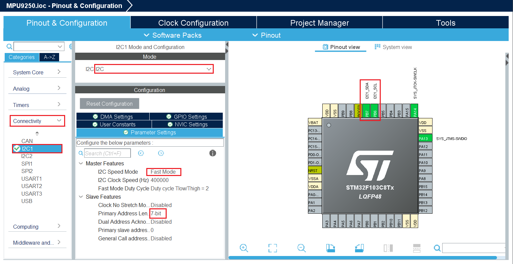

# I2C

## Теория ##

Шина I
2C - это очень популярная и мощная шина, используемая для связи между ведущим устройством (или несколькими
ведущими устройствами) и одним или несколькими подчиненными устройствами. На рисунке 1 показано, сколько различных периферийных устройств может
совместно использовать шину, подключенную к процессору всего по двум проводам, что является одним из самых больших преимуществ

шины I 2C по сравнению с другими интерфейсами.
Это руководство по применению предназначено для того, чтобы помочь пользователям понять, как
работает шина I 2C.
На рисунке 1 показан типичный пример I
Шина 2C для встраиваемой системы, в которой используется несколько подчиненных устройств. То
микроконтроллер представляет собой I
2C master и управляет расширителями ввода-вывода, различными датчиками, EEPROM,
АЦП/ЦАП и многое другое. Все они управляются всего двумя контактами от главного устройства.


## Практика ##

### Описание библиотеки ###

Так как нам нужно получать данные об ускорении движения ракеты, на борту у нас будет стоять датчик MPU9250, он общается с микроконтроллером с помощью интерфейса I2C.

Как инициализировать датчик и забирать из его памяти значения [гироскопа](https://ru.wikipedia.org/wiki/%D0%93%D0%B8%D1%80%D0%BE%D1%81%D0%BA%D0%BE%D0%BF), [акселерометра](https://ru.wikipedia.org/wiki/%D0%90%D0%BA%D1%81%D0%B5%D0%BB%D0%B5%D1%80%D0%BE%D0%BC%D0%B5%D1%82%D1%80) и [магнитометра](https://ru.wikipedia.org/wiki/%D0%9C%D0%B0%D0%B3%D0%BD%D0%B8%D1%82%D0%BE%D0%BC%D0%B5%D1%82%D1%80) вы можете почитать в [Product Specification](../../doc/PS_MPU9250.1.pdf) или [Register Map](../../doc/RM_MPU9250.pdf).

Чтобы упростить и ускорить процесс работы с датчиком mpu9250 воспользуемся готовой библиотекой, которая состоит из .c файла [MPU9250.c](./example/Core/Src/MPU9250.c) и трех .h файлов [i2c_er.h](./example/Core/Inc/i2c_er.h) ; [MPU9250_reg.h](./example/Core/Inc/MPU9250_reg.h) ;
[MPU9250.h](./example/Core/Inc/MPU9250.h).

В файле [i2c_er.h](./example/Core/Inc/i2c_er.h) описываюся порты и пины проводов SDA и SCL , а также реализованы две функции для удобной работы с i2c, они используются в функциях, описанных в файле MPU9250.c

В файле [MPU9250_reg.h](./example/Core/Inc/MPU9250_reg.h) задефайнены адреса регистров mpu, которые описаны в [Register Map](../../doc/RM_MPU9250.pdf). Это сделано для читаемости кода, чтобы не было необходимости при чтении или записи в mpu каждый раз обращаться к карте адресов.

Основные два файла это [MPU9250.c](./example/Core/Src/MPU9250.c) и [MPU9250.h](./example/Core/Inc/MPU9250.h) в них описаны функции инициализации датчиков встроенных в mpu9250.

Пройдемся вкратце по основным функциям:

- void MPU_init(void);                      //функция инициализации акселерометра и гироскопа.
- void MAGN_init(float * destination);      //функция инициализации магнитометра.
- void MPU_get_magn(int16_t * destination); //получить 
- void MPU_get_accel(float * destination);
- void MPU_get_gyro(float * destination);

Как вы могли заметить, некоторые функции принимают аргументом указатель на int16_t или float: в функциях, в названиях которых присутствует приставка get, значения с соответствующего датчика будут класться в массив, указатель на который вы передадите в функцию.

В коде эти массивы задаются вот так:

```
/* USER CODE BEGIN PV */
float destination_a[3] = { 0, };
float destination_g[3] = { 0, };
int16_t destination_m[3] = { 0, };
```

### Создание проекта CubeIde ###

Создаем проект в CubeIde ⇒ подключаем пины для интерфейса отладки Serial Wire ⇒ включаем i2c1:



Во вкладке Mode выбираем I2C и переходим к Configuration:
Первым выставим скорость передачи данных:
stm32 поддерживает две скорости передачи: это Standard Mode (Clock Speed == 100MHz) и Fast Mode (Clock Speed == 400MHz). В нашем случае можно выбрать любую скорость передачи, я сделаю так:

**I2C Speed Mode** == **Fast Mode**

В этот момент автоматически изменится Clock Speed.

Остальные настройки оставляем по умолчанию.

В правой части экрана выделились два пина PB6 и PB7, соответственно SCL и SDA.

С настройками в CubeIde все ⇒ генерируем код.

### Подключение библиотеки ###

После автоматической генерации файлов CubeMx подключим нашу библиотеку к проекту, для этого:

В проводнике в папке проекта заходим в папку Src по адресу ***../MPU9250/example/Core/Src*** и вставляем туда файл [MPU9250.c](./example/Core/Src/MPU9250.c)

и в папку Inc по адресу ***../MPU9250/example/Core/Inc*** и вставляем туда файлы:
- [MPU9250.h](./example/Core/Inc/MPU9250.h)
- [i2c_er.h](./example/Core/Inc/i2c_er.h)
- [MPU9250_reg.h](./example/Core/Inc/MPU9250_reg.h)

Далее удаляем проект из Project Explorer


Далее откроем проект заново: для этого запускаем файл .project из папки с проектом и проект откроется в CubeIde уже с файлами библиотеки в папках Inc и Src.

После подключения файлов, проверьте, что в файле [i2c_er.h](./example/Core/Inc/i2c_er.h) для проводов SCL и SDA указаны нужные порты и пины (как в CubeMx):

```
#define SCL_PIN     GPIO_PIN_6
#define SCL_PORT    GPIOB

#define SDA_PIN     GPIO_PIN_7
#define SDA_PORT    GPIOB
```

Далее перейдем к файлу **main.c**

В первую очередь подключим необходимые файлы библиотек:

```
/* USER CODE BEGIN Includes */
#include "string.h"
#include <stdio.h>
#include "i2c_er.h"
#include "MPU9250_reg.h"
#include "MPU9250.h"
/* USER CODE END Includes */
```

Создадим массивы куда будем складывать данные акселерометра, гироскопа и магнетометра:

```
/* USER CODE BEGIN PV */
float destination_a[3] = { 0, };
float destination_g[3] = { 0, };
int16_t destination_m[3] = { 0, };
```

Проинициализируем акселерометр, гироскоп и магнетометр:
```
/* USER CODE BEGIN 2 */
MPU_init();
MAGN_init((float*)destination_m);
/* USER CODE END 2 */
```

Теперь в бесконечном цикле будем считывать значения с mpu:

```
/* USER CODE BEGIN WHILE */
  while (1)
  {
	  MPU_get_gyro(destination_g);
	  MPU_get_accel(destination_a);
	  MPU_get_magn(destination_m);
    /* USER CODE END WHILE */

```